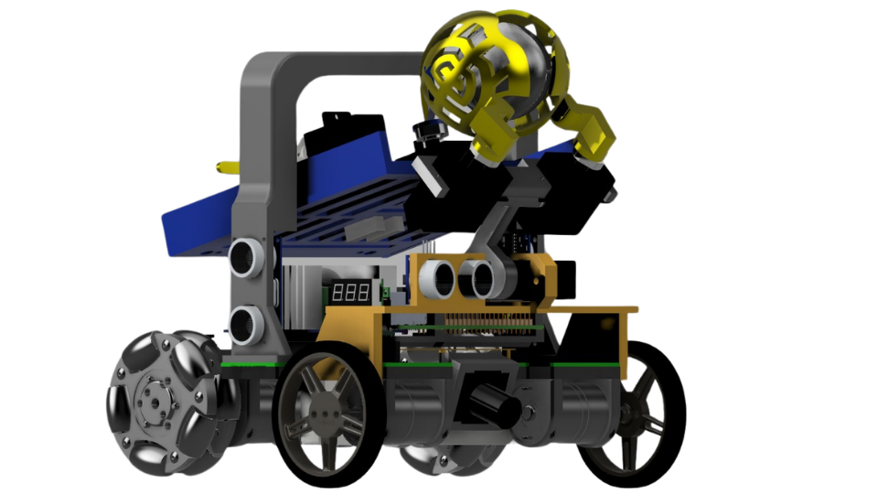
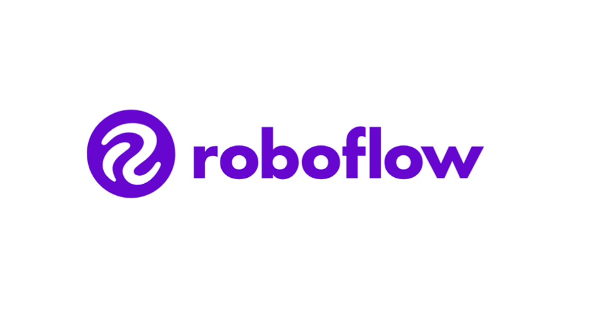
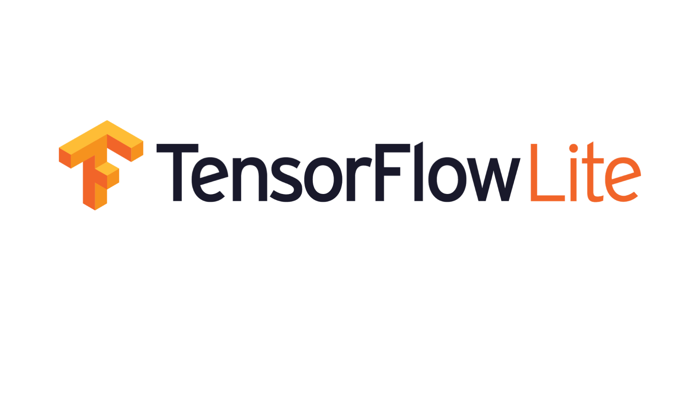

# RescueBot IITA - RoboCupJunior Rescue Line 2026

<p align="center">
  
</p>

<p align="center">
  <strong>Autonomous Rescue Line robot by IITA Salta, Argentina.</strong><br>
  Built for line following, obstacle handling, victim detection, rescue-zone collection, sorting, deposit and evacuation-zone exit.
</p>

<p align="center">
  <a href="LICENSE"></a>
  
  
  
  
  
  
  
</p>

## About The Competition

<p align="center">
  <i>
    RoboCupJunior Rescue Line challenges teams to build a fully autonomous robot that can navigate a disaster-inspired course, follow lines, handle obstacles, identify victims, move them to safe evacuation zones and leave the rescue area without human assistance.
  </i>
</p>

<p align="center">
  <a href="https://junior.robocup.org/">RoboCupJunior</a> |
  <a href="https://junior.robocup.org/rcj-rescue-line/">Rescue Line</a> |
  <a href="https://rescue.rcj.cloud/documents">Official Rescue Documents</a>
</p>

## About The Robot


RescueBot IITA is a fully autonomous RoboCupJunior Rescue Line robot developed by students from the Instituto de Innovacion y Tecnologia Aplicada (IITA), Salta, Argentina. The robot combines a custom 3D-printed Fusion 360 chassis, a five-servo rescue mechanism, a custom electronics stack, a Raspberry Pi 4B vision system and a Teensy 4.1 real-time controller.

The robot was built to complete the full Rescue Line mission as an integrated system: line following, green-marker decisions, obstacle handling, rescue-zone entry, victim collection, sorting, deposit and evacuation-zone exit. The Raspberry Pi handles vision and high-level decisions, while the Teensy keeps movement, sensors, servos and safety routines deterministic.

<br clear="left">


The mechanical design focuses on serviceability. The chassis is compact, printable and organized in layers: drivetrain below, electronics in the middle and the rescue mechanism above/front. The project also keeps the engineering trail visible: CAD files, electronics references, firmware, Raspberry Pi code, AI model evolution, test logs and the Team Description Paper are all kept in the repository.

<br clear="right">

## What The Robot Does

| Mission stage | How RescueBot handles it |
|---|---|
| Line course | Raspberry Pi camera pipeline tracks the black line, green markers, red stop line and silver rescue-zone entry. |
| Motion control | Teensy 4.1 executes motor control, encoder movements, IMU turns, distance sensing and safety behavior. |
| Obstacle handling | Ultrasonic and ToF sensors support obstacle detection, wall approach and rescue-zone alignment. |
| Rescue-zone perception | YOLOv8n/TFLite detects black victims, silver victims and high red/green deposit zones. |
| Victim handling | A five-servo claw collects, lifts, sorts, stores and deposits victims. |
| Reliability | Serial protocol guards, timeout fixes, APDS9960 floor sensing and documented tests target competition robustness. |

## Robot At A Glance

| Area | Current design |
|---|---|
| Robot name | Jesus |
| Competition | RoboCupJunior Rescue Line 2026 |
| Main compute | Raspberry Pi 4B |
| Real-time control | Teensy 4.1 with Arduino/PlatformIO |
| Vision stack | OpenCV + YOLOv8n exported to TFLite |
| AI classes | `negro`, `plateado`, `rojo_alto`, `verde_alto` |
| CAD | Fusion 360, editable `.f3z` assembly |
| Actuation | Four encoder motors + five clutch servos |
| Sensors | Wide camera, BNO055, VL53L0X, HC-SR04, APDS9960 |
| Measured mass | 1404 g |
| CAD envelope | 157.189 mm L x 176.913 mm W x 176.239 mm H |

## Visual Tour

<table>
  <tr>
    <td align="center"><br><strong>Left</strong></td>
    <td align="center"><br><strong>Back</strong></td>
    <td align="center"><br><strong>Right</strong></td>
  </tr>
  <tr>
    <td align="center"><br><strong>Front</strong></td>
    <td align="center"><br><strong>Bottom</strong></td>
    <td align="center"><br><strong>Top</strong></td>
  </tr>
</table>

More mechanical details are available in [hardware/mechanical](hardware/mechanical/README.md), including the editable Fusion 360 archive [Final_Robot.f3z](hardware/mechanical/Final_Robot.f3z).

## System Architecture

<p align="center">
  
</p>

The robot uses a dual-controller architecture:

- **Raspberry Pi 4B:** camera processing, line tracking, marker detection, rescue-zone AI inference and high-level state decisions.
- **Teensy 4.1:** deterministic motor control, encoders, BNO055 IMU, distance sensors, APDS9960 color sensing, servos, switch/stop behavior and recovery routines.
- **UART protocol:** small 8-byte frames from Raspberry Pi to Teensy plus status bytes from Teensy to Raspberry Pi keep the robot synchronized without a heavy network stack.

## AI And Vision

<table>
  <tr>
    <td align="center" width="25%">
      <br>
      <strong>Dataset</strong><br>
      Image collection, labeling and class balancing.
    </td>
    <td align="center" width="25%">
      <br>
      <strong>Detector</strong><br>
      YOLOv8n model for victims and deposit zones.
    </td>
    <td align="center" width="25%">
      <br>
      <strong>Training</strong><br>
      100-epoch training and validation workflow.
    </td>
    <td align="center" width="25%">
      <br>
      <strong>Deployment</strong><br>
      TFLite inference on the Raspberry Pi 4B.
    </td>
  </tr>
</table>

The rescue-zone detector evolved through several model and dataset versions. The final documented model uses YOLOv8n exported to TFLite with embedded NMS so it can run on the Raspberry Pi 4B without an external AI accelerator.

| Metric | Documented value |
|---|---:|
| Dataset images | 6256 |
| Dataset annotations | 9521 |
| Null examples | 711 |
| Validation precision | 0.971 |
| Validation recall | 0.929 |
| Validation mAP50 | 0.932 |
| Raspberry Pi rescue/deposit loop | 22.25-22.40 FPS |
| Raspberry Pi line loop | 91.33 FPS |

See [software/raspberry/AI](software/raspberry/AI/README.md) and [docs/tdp/roboflow-dataset-status-2026-05-23.md](docs/tdp/roboflow-dataset-status-2026-05-23.md) for the full model history, dataset notes and validation evidence.

## Mechanical Design

<p align="center">
  
</p>

The robot is designed as a compact 3D-printed assembly with serviceable mechanical modules:

- Low drivetrain layer with four 12 V encoder motors.
- Electronics and wiring layer for Raspberry Pi, Teensy, PCB and battery access.
- Front rescue mechanism with two gripper servos, lift servo, sorting servo and deposit servo.
- Sensor mounts for camera, ultrasonic sensors, ToF sensors and APDS9960 floor sensing.
- CAD views and editable Fusion 360 source for inspection and future improvements.

## Electronics And Control

The electronics are organized around separated power and control paths:

- 3S 11.1 V LiPo battery.
- 12 V motor path.
- 5 V compute/control rail for Raspberry Pi and Teensy.
- 6.1 V measured servo rail for the rescue mechanism.
- Custom PCB and documented power tree.

Key references:

- [PCB documentation](hardware/electronics/PCB_Main/README.md)
- [Verified component specs](hardware/electronics/PCB_Main/COMPONENT_SPECS_VERIFIED.md)
- [Hardware change notes](hardware/cambios_de_hardware.md)

## Performance Evidence

The repository keeps test logs instead of only final claims. Current documented samples include:

| Test area | Evidence |
|---|---|
| Battery/runtime | 1 h continuous runtime until 10.5 V; 10 min high-stress run without observed reset. |
| Movement | `runDistance()` error around 1-2 cm; IMU turns stop around 1 degree. |
| Vision speed | 91.33 FPS line following; 22.25-22.40 FPS rescue/deposit loop. |
| Pickup/deposit sample | 8/10 pickup attempts; 10/10 deposit attempts. |
| Full-course validation | Recorded run with line, rescue, deposit and evacuation-zone exit after the exit-search correction. |
| Lighting robustness | Anti-flash + AGCWD + final model tested against flashlight stress and colored walls. |

Read the test log in [testing/TEST_LOG.md](testing/TEST_LOG.md). The full-course evidence video referenced by the TDP is available here: [YouTube run video](https://www.youtube.com/watch?v=CPpj4CvyvyA).

## Components

| Subsystem | Main components |
|---|---|
| Compute | Raspberry Pi 4B 8GB, Teensy 4.1 |
| Vision | Wide USB camera, OpenCV, YOLOv8n/TFLite |
| Motion | 4x 12 V 159 RPM encoder motors, fixed wheels, omniwheels |
| Rescue mechanism | 5x DFRobot 2 kg 300 degree clutch servos |
| Distance sensing | HC-SR04 ultrasonic sensors, VL53L0X ToF sensors |
| Orientation and floor sensing | BNO055 IMU, APDS9960 color/proximity sensor |
| Power | 3S 11.1 V LiPo battery, XL4016 5 V rail, MP1584 servo rail |
| Mechanical | Fusion 360 CAD, 3D-printed chassis and custom mounts |

## Repository Map

| Path | Purpose |
|---|---|
| [software/raspberry](software/raspberry/README.md) | Raspberry Pi code for line following, rescue vision, AI inference and serial state handling. |
| [software/teensy/firmware](software/teensy/firmware/) | Teensy 4.1 firmware, PlatformIO config, drivebase, claw and sensor code. |
| [software/raspberry/AI](software/raspberry/AI/README.md) | AI model history, dataset versions and model inspection tools. |
| [hardware/mechanical](hardware/mechanical/README.md) | Fusion 360 CAD, robot views and mechanical source files. |
| [hardware/electronics](hardware/electronics/) | PCB, power tree, datasheets and electronics documentation. |
| [docs/tdp](docs/tdp/) | Team Description Paper, diagrams, evidence summaries and final documentation assets. |
| [testing](testing/README.md) | Test logs and validation records. |
| [research](research/) | Research notes, benchmarks and external references. |
| [project](project/) | Backlog and project-management notes. |

## Quick Start

### Raspberry Pi software

```bash
python -m pip install -r software/raspberry/requirements.txt
```

Main competition code:

```bash
cd software/raspberry/final_rpi
python Main.py
```

### Teensy firmware

Requires [PlatformIO](https://platformio.org/) and the PJRC Teensy loader/toolchain.

```bash
cd software/teensy/firmware
pio run
pio run --target upload
```

### Mechanical CAD

Open the editable Fusion 360 archive:

```text
hardware/mechanical/Final_Robot.f3z
```

## Documentation Highlights

- [Team Description Paper source](docs/tdp/TDP-IITA-2026.md)
- [Technical Poster](docs/poster/Poster%20final.pdf)
- [Code reliability evidence](docs/tdp/code-reliability-evidence-2026.md)
- [Raspberry Pi and YOLO notes](docs/es/yolo-raspberry.md)
- [Raspberry Pi to Teensy communication](docs/es/comunicacion-rpi-teensy.md)
- [Firmware libraries](docs/es/librerias-firmware.md)
- [Contribution guide](CONTRIBUTING.md)

## Useful Links

- [Full-course run video](https://www.youtube.com/watch?v=CPpj4CvyvyA)
- [Mechanical CAD package](hardware/mechanical/README.md)
- [AI model evolution](software/raspberry/AI/README.md)
- [Testing evidence log](testing/TEST_LOG.md)
- [RoboCupJunior Rescue Line](https://junior.robocup.org/rcj-rescue-line/)
- [Official Rescue documents](https://rescue.rcj.cloud/documents)

## Contact And Social Media

<p align="center">
  <a href="https://www.youtube.com/@iita-tecnologia-aplicada" target="_blank">
    
  </a>
  <a href="https://www.tiktok.com/@iita_salta" target="_blank">
    
  </a>
  <a href="https://www.linkedin.com/company/iita---instituto-de-innovaci%C3%B3n-y-tecnolog%C3%ADa-aplicada/posts/?feedView=all" target="_blank">
    
  </a>
  <a href="https://www.facebook.com/IITARoboticaEducativa" target="_blank">
    
  </a>
  <a href="https://www.instagram.com/iita_salta" target="_blank">
    
  </a>
</p>

## Team

| Role | Member |
|---|---|
| Line-following vision and camera processing | Lucio Saucedo |
| Raspberry Pi integration, AI and electronics | Benjamin Villagran |
| 3D design, Teensy firmware and rescue mechanism | Laureano Monteros |
| Mentor / coach support | Enzo Juarez, Gustavo Viollaz |

**Institution:** Instituto de Innovacion y Tecnologia Aplicada (IITA), Salta, Argentina

**Contact:** rescuebot.salta@gmail.com

## Project Status

This repository is under active 2026 competition development. Current project status and real pending work are tracked through GitHub Issues and the coach/director report in [docs/es/2026-05-31-informe-coach-auditoria-integral.md](docs/es/2026-05-31-informe-coach-auditoria-integral.md). The older [AUDIT-ACTION-PLAN.md](AUDIT-ACTION-PLAN.md) remains available as historical context.

Validation work is documented in [testing/TEST_LOG.md](testing/TEST_LOG.md) and the project backlog.

## License

This project is released under the MIT License. See [LICENSE](LICENSE).
