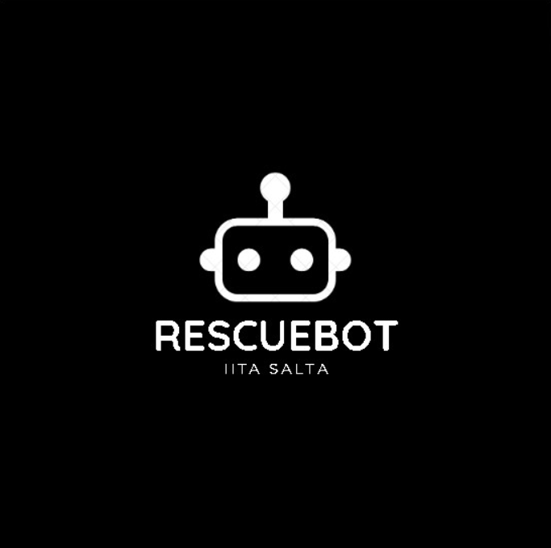
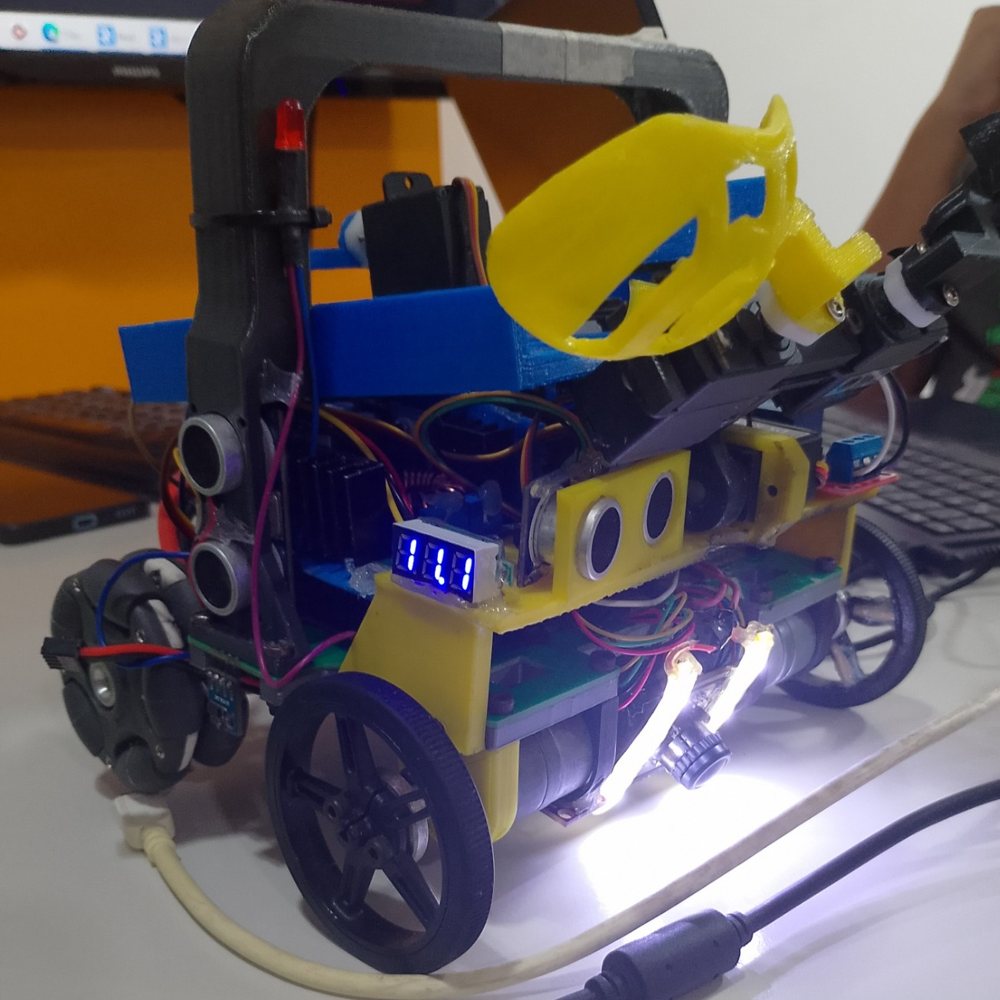
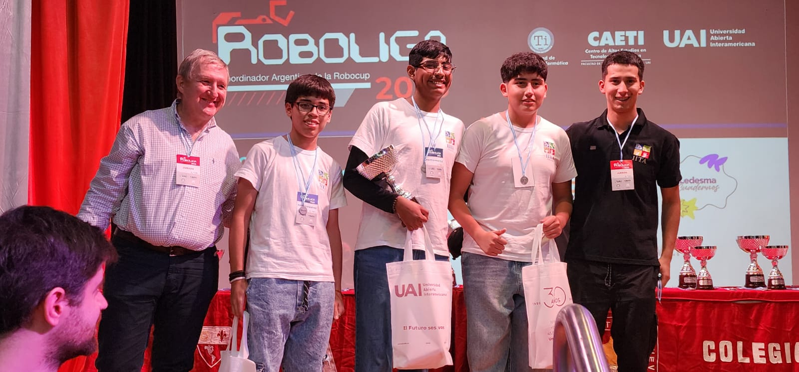
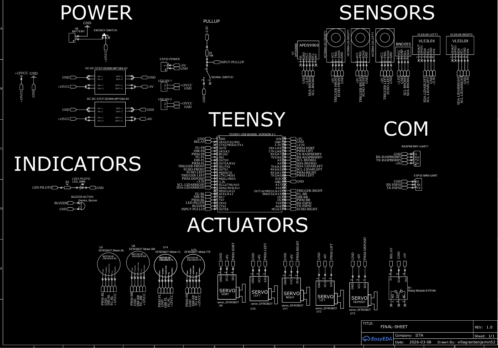
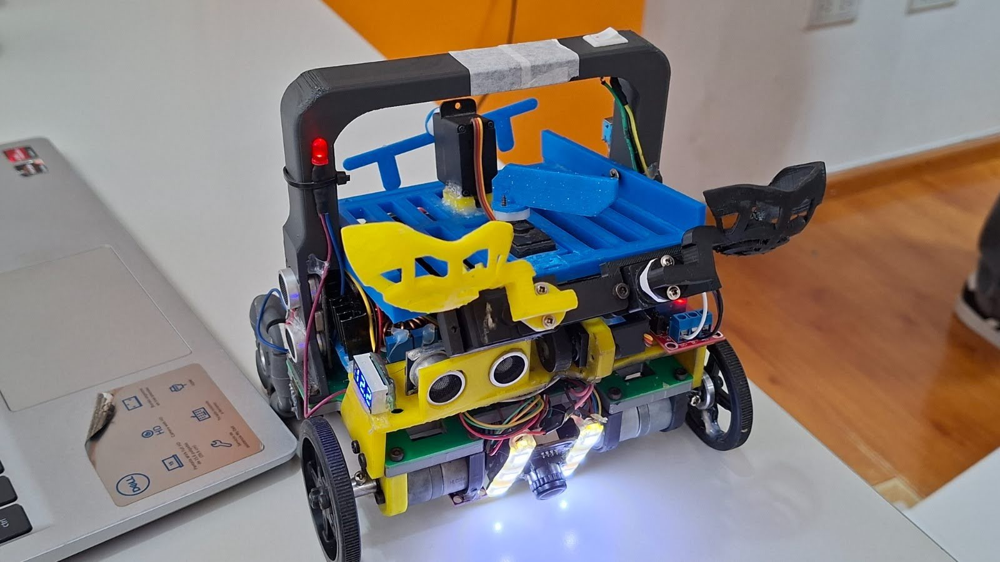
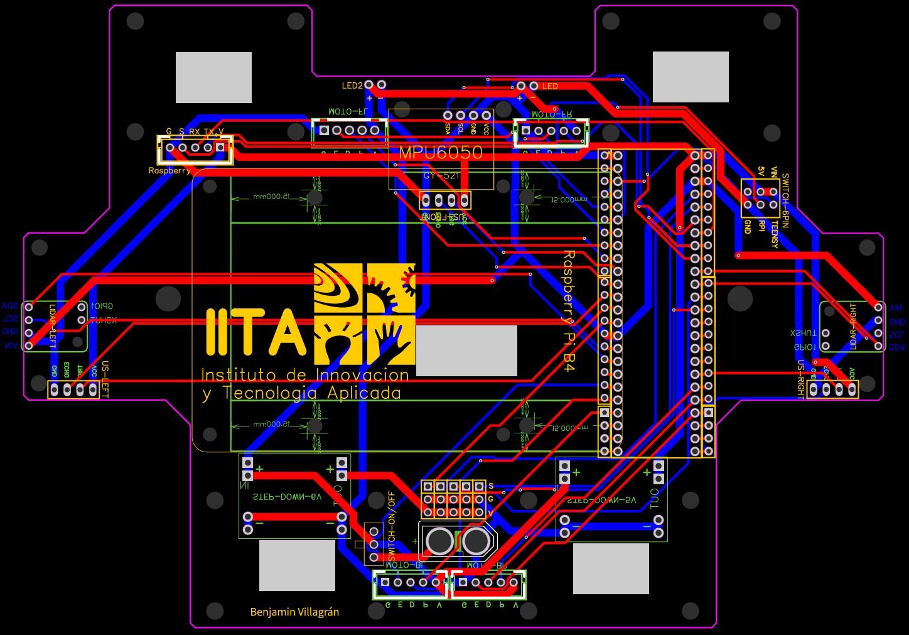

# RescueBot — Team Description Paper
## RoboCupJunior Rescue Line 2026

**Team name:** RescueBot  
**Institution:** IITA (Institute of Innovation and Applied Technology)  
**Location:** Salta, Salta Province, Argentina  
**Competition:** RoboCupJunior Rescue Line 2026, Incheon, South Korea  
**Contact:** rescuebot.salta@gmail.com  

---

## Abstract

RescueBot is a fully custom autonomous rescue robot developed for RoboCupJunior Rescue Line. The project was designed from the ground up to maximize reliability, competition readiness, and task completion across the full Rescue Line challenge set. Rather than optimizing only for speed, our design emphasizes robustness, stable perception, victim handling, selective deposition, and consistent behavior under changing field conditions.

The system follows a two-computer architecture: a Raspberry Pi 5 performs vision and AI-based detection, while a Teensy 4.1 manages real-time motion, sensors, and actuators. The robot includes a custom 3D-printed mechanical structure, a custom PCB, four DC motors with encoders, an IMU, ultrasonic sensors, ToF sensors, a color sensor, a USB camera, and a multi-servo rescue mechanism for classification and deposition of balls. The software was developed in Python and C++, and the vision model was trained by our team using more than 2500 images.

Our robot evolved through multiple design generations since 2023 and reached its final version in 2026 after extensive testing, calibration, and integration work.

---

## 1. Introduction

The Rescue Line category requires a robot capable of navigating a marked environment, reacting to obstacles, detecting special surfaces and targets, and performing autonomous rescue tasks reliably. Our team designed RescueBot with these requirements in mind, prioritizing completeness of execution and mechanical stability over maximum speed.

The project was developed as an engineering system, not as a simple assembly of parts. All major subsystems were designed specifically for this robot, including the mechanical structure, electronics integration, software architecture, and rescue strategy. This allowed us to tailor the platform to the competition instead of adapting a generic educational robot.

The current version of RescueBot is the result of continuous improvement since the first prototype in 2023. Each generation improved the previous one in terms of integration, robustness, sensor placement, and software structure.

---

## 2. Project Planning

### 2.1 Requirements Definition

At the beginning of the project, we established the main engineering requirements based on the Rescue Line rules and on the challenges expected in competition:

- follow the line robustly under variable lighting
- detect special surfaces and rescue signals
- avoid obstacles safely
- detect and classify victims using vision and sensors
- store, separate, and deposit victims selectively
- remain mechanically stable during ramps and uneven motion
- keep the system modular for debugging and maintenance

These requirements shaped every design decision. Because the robot must complete the full task set, we accepted a trade-off between speed and capability. The final design is slightly larger and slower than minimal line-following robots, but it can execute the complete rescue sequence.

### 2.2 Overall Project Plan

The project was organized in progressive development stages:

1. concept definition and initial architecture
2. mechanical prototype design
3. PCB and electronic integration
4. software development for vision and control
5. subsystem calibration
6. full-robot integration
7. testing and optimization
8. final iteration and reliability improvement

The workload was divided among team members according to specialization, while key decisions were reviewed collectively. Weekly meetings and additional weekday work sessions were used to maintain progress and solve integration issues early.

### 2.3 Team Roles

- **Lucio Saucedo** — Raspberry Pi programming in Python, documentation
- **Benjamín Villagram** — PCB design, Teensy programming
- **Laureano Monteros** — Teensy programming, 3D mechanical design

Mentoring and technical guidance were provided by **Enzo Juárez** and **Engineer Gustavo Viollaz**.

### 2.4 Integration Plan / System Engineering

RescueBot was designed as a layered system:

- **Perception layer:** USB camera, color sensor, ultrasonic sensors, ToF sensors, IMU, encoders
- **Decision layer:** Raspberry Pi vision and AI logic
- **Control layer:** Teensy real-time motion and actuator control
- **Actuation layer:** motors, servos, relay-driven mechanisms

This separation makes the architecture easier to debug and improves timing reliability. High-level decisions are computed on the Raspberry Pi, while the Teensy maintains deterministic motion control and safety handling.

---

## 3. Mechanical Design

### 3.1 Structure and Manufacturing

The mechanical structure was fully designed by our team using Fusion 360 and fabricated by 3D printing. Our focus was to build a structure capable of integrating all the required systems in a competition-oriented layout.

The chassis was developed through several versions to improve rigidity, packaging, and accessibility. The final structure supports the sensors, battery, PCBs, motion system, and ball-handling mechanism while remaining serviceable during competition.

The robot measures:

- **Width:** 180 mm
- **Length:** 150 mm
- **Height:** 185 mm
- **Weight:** 1.3 kg

### 3.2 Locomotion System

The robot uses four DC motors with encoders. The wheel arrangement combines:

- 2 front rubber wheels
- 2 rear omnidirectional wheels

This configuration offers a compromise between traction, maneuverability, and stability. The front wheels provide grip, while the rear omni wheels improve turning and directional flexibility. The encoder feedback supports distance-based motion and repeatable maneuvers.

### 3.3 Ball Handling and Rescue Mechanism

Our rescue mechanism was designed around an upper storage area or “corral” with selective sorting. The system includes two servos:

- one servo separates black and silver balls
- one servo deposits the selected ball to the correct side

This mechanism allows the robot to store rescued balls and classify them before deposition. The design is intentionally larger than a minimal intake system because it increases functional coverage during competition.

### 3.4 Mechanical Innovation

The most important mechanical innovation is the top-mounted rescue corral integrated with selective deposition. Instead of only collecting victims, RescueBot classifies them and manages them internally before release. This gives us a strategic advantage in tasks that require differentiated handling of objects.

Another important innovation is the fully custom chassis and internal layout. Because the robot was not built from a preassembled kit, we could optimize the structure for our competition strategy.

---

## 4. Electronic Design

### 4.1 System Architecture

The robot uses a dual-processor architecture:

- **Raspberry Pi 5 (8 GB)** — vision, AI inference, object classification, line analysis
- **Teensy 4.1** — low-level motion control, sensors, servo logic, safety control

The communication between both boards is performed via **UART**.

This architecture allows the vision system to run without interrupting real-time control. The Teensy receives compact command packets and converts them into motor and actuator actions.

### 4.2 Custom PCB

The robot includes a custom PCB designed by the team. The PCB improves cable organization, reduces wiring errors, and makes the system more maintainable. It also supports cleaner integration of sensors and actuators than a breadboard-based design.

### 4.3 Power System

The robot is powered by a **11.1V LiPo battery with 2200 mAh capacity**. The power system feeds the drivetrain and the electronics through regulated distribution.

We use two independent switches:

- one master switch for full robot power-off
- one system switch to stop the Teensy and Raspberry software without fully powering down the robot

This second switch is useful because the system can be paused and restarted faster during testing and competition handling.

### 4.4 Reliability and Safety

A red LED indicates the system status:

- blinking: program paused
- steady on: program running correctly
- off: software did not start

  
  

This simple indicator helps us diagnose problems quickly during setup.

---

## 5. Sensor System

RescueBot uses multiple sensors to create a robust perception stack:

- USB camera
- 3 ultrasonic sensors
- 2 VL53L0X ToF sensors
- IMU: Adafruit BNO055
- APDS9960 color sensor
- wheel encoders

The ultrasonic sensors are used for obstacle detection and proximity awareness. The ToF sensors help with wall-following and distance control. The IMU provides yaw and pitch estimates for heading correction and ramp handling. The encoders support motion consistency. The color sensor adds another layer of environmental perception for task logic.

---

## 6. Software Architecture

### 6.1 High-Level Structure

The software is divided into two main parts:

- **Raspberry Pi (Python):** image processing, AI inference, target tracking, line angle estimation, classification logic, and UART command generation
- **Teensy (C++):** motion control, sensor reading, actuator control, task execution, and safety handling

The Raspberry Pi performs high-level perception at real time. When the AI model is active, the system runs at about **20 FPS**. In normal operation, frame acquisition is continuous.

### 6.2 Communication Protocol

The Raspberry Pi sends structured packets over UART. The Teensy reads the packet stream and updates:

- speed
- steering
- task state
- line / special-surface status

This compact protocol keeps communication efficient and reliable.

### 6.3 State Machine

The robot uses a state-based architecture. Main states include:

- waiting
- line following
- rescue mode
- deposit logic

This structure reduces software complexity and makes behavior easier to debug.

(image of software flowchart)

---

## 7. Vision and AI

### 7.1 Vision Pipeline

The Raspberry Pi 5 uses Python, OpenCV, and YOLO to process the camera stream. The camera-based system is responsible for:

- line angle estimation
- black ball detection
- silver ball detection
- red and green deposit-zone detection
- noise filtering
- target stabilization

### 7.2 AI Model

We trained our own detection model using a dataset of **more than 2500 images**. The model is used to detect:

- black balls
- silver balls
- red deposit corners
- green deposit corners

This custom training gave us control over the classes and behavior needed for competition.

### 7.3 Detection Stability

The code includes mechanisms to stabilize detection, reduce noise, and preserve the last valid target when possible. This improves behavior when the view is partially occluded or the scene changes quickly.

### 7.4 Line Estimation

The line-following system uses camera-based angle estimation. The robot computes the line orientation and then converts the result into steering correction. This approach is flexible and allows the robot to adapt to different line positions and lighting conditions.

---

## 8. Motion and Control

The Teensy 4.1 controls the drivetrain using encoder feedback and motion primitives:

- timed motion
- angle rotation using IMU yaw
- distance motion using encoder counts
- wall-aligned straight movement using IMU + ToF feedback

### 8.1 Heading Control

The BNO055 IMU provides yaw for turning and heading correction. This allows the robot to rotate by known angles and return to a stable orientation after maneuvers.

### 8.2 Ramp Adaptation

The pitch value from the IMU is used to reduce speed when the robot is climbing or descending. This helps preserve stability and prevents excessive acceleration on ramps.

### 8.3 Wall Following

The robot can maintain a reference distance from a wall using the ToF sensors. This is useful for controlled movement in rescue conditions and for better position recovery.

### 8.4 Encoder-Based Motion

Encoders are used to define distance-based movement and to improve repeatability in tasks that require precise travel.

---

## 9. Rescue Strategy

RescueBot was designed to complete the full rescue workflow:

1. follow the line
2. detect special conditions
3. identify victims and objects
4. classify balls by color
5. store and separate them
6. deposit them selectively
7. recover from obstacles and special surfaces

The robot was intentionally designed to handle more tasks, even at the cost of raw speed. We believe reliability and completeness are the most important factors for a strong Rescue Line performance.

### 9.1 Ball Detection and Classification

The YOLO model detects the target balls and deposit zones. When the robot identifies a ball, the system selects the corresponding action and routes the object through the corral mechanism.

### 9.2 Selective Deposition

The robot can separate black and silver balls using the upper servo mechanism and deposit them independently. This behavior is a major advantage when multiple victims must be handled in one run.

### 9.3 Obstacle Handling

The robot uses ultrasonic sensors to avoid obstacles and to support local decision-making when the path is blocked or constrained.

---

## 10. Testing and Reliability

We performed several categories of tests during development:

- speed testing
- lighting sensitivity testing
- ramp testing
- lateral incline testing
- AI detection validation
- integration tests between Raspberry Pi and Teensy

### 10.1 Lighting Tests

Lighting variation was one of our most important challenges. Since the vision system relies on color ranges, scene brightness affects detection thresholds.

### 10.2 Solution

When the environment changes, we recalibrate the color ranges to restore performance. This approach works reliably, although it requires preparation at new venues.

### 10.3 Performance Results

- average speed: **10 cm/s**
- full run time on a non-complex course: **about 150 s**
- battery endurance: **about 20 minutes** under full-load operation

These results reflect a design optimized for competition completeness rather than maximum speed.

---

## 11. Problems and Solutions

### Problem 1: Lighting sensitivity in vision
**Cause:** camera-based color thresholds change with illumination.  
**Solution:** recalibration of detection ranges at each venue.  
**Result:** stable behavior after setup.

### Problem 2: Large amount of hardware inside the robot
**Cause:** many sensors, control boards, and actuators must fit inside one chassis.  
**Solution:** custom 3D-printed layout and PCB integration.  
**Result:** better organization and maintainability.

### Problem 3: Ramp instability
**Cause:** center of mass and robot layout affect incline performance.  
**Solution:** lower center of mass and optimize internal organization in future iterations.  
**Result:** improved behavior on standard ramps; lateral ramps remain a target for the next version.

---

## 12. Innovation

RescueBot’s innovation comes from the combination of custom hardware, custom software, and competition-specific integration. Our robot differs from many common educational platforms because it was not built around a preassembled kit. Instead, every major subsystem was designed for this challenge.

Our most important innovations are:

- custom 3D-printed chassis
- custom PCB
- dual-processor architecture
- team-trained YOLO model
- selective victim sorting and deposition
- IMU + ToF + encoder control fusion

These features give the team more flexibility and better adaptation to the Rescue Line category.

---

## 13. Future Work

Before competition, we plan to improve:

- AI robustness
- center of mass and internal layout
- predictive control

These improvements are intended to increase reliability, especially on ramps and in more difficult field conditions.

---

## 14. Conclusion

RescueBot is the result of a multi-year engineering process focused on building a fully autonomous Rescue Line robot from scratch. The final system integrates custom mechanics, custom electronics, and custom software into a unified platform that can perform the full set of competition tasks.

Our priority was never speed alone. Instead, we designed for reliability, adaptability, and complete task execution. The robot’s architecture, testing process, and iterative development reflect the goals of a professional competition engineering project.

---

## 15. Acknowledgements

We thank our mentor **Enzo Juárez** and **Engineer Gustavo Viollaz** for their support, technical guidance, and constant encouragement throughout the project.

---
