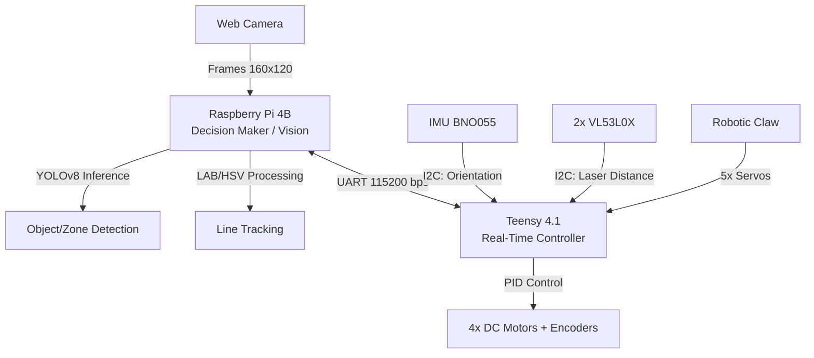

<!-- AUTO-GENERATED FILE – DO NOT EDIT.
     Source: docs/es (Spanish is source of truth)
     This file is generated by GitHub Actions.
-->

# Comprehensive Analysis of Robotic Architecture - RCJ 2026

> **Authorship Note:** This document was generated by **Ai Gemini** at the request of **Gustavo Viollaz**. The analysis is based on a thorough review of the source code of the Teensy 4.1 and Raspberry Pi 4B hosted in this repository as of February 22, 2026.

## 1. System Overview

The IITA robot for RoboCup Junior Rescue Line 2026 utilizes a **Decentralized Hybrid Architecture**. This configuration separates high-latency and intensive processing tasks (vision and inference) from deterministic and real-time tasks (motor control and reading critical sensors).

### Data Flow Diagram

---

## 2. Software Analysis (Teensy Firmware)

The Teensy acts as the "peripheral nervous system." It implements robust low-level control but has opportunities for optimization in its concurrency management.

### Key Components
- **DriveBase & Motors:** Differential control of 4 wheels. The use of `micros()` for RPM calculation allows for precise PID, although it is vulnerable to noise in the encoder signal.
- **State Logic:** The robot alternates between `routine = "line"` and `routine = "rescue"`. The transition is triggered by the Raspberry Pi upon detecting the entry pattern into the rescue zone (silver).

### Identified Improvement Points
1. **Elimination of Blocking:** The current firmware uses `delay()` in the claw sequences (`claw.cpp`). This halts the calculation of motor RPMs. It is recommended to migrate to a **Non-blocking Finite State Machine (FSM)**.
2. **UART Robustness:** The current parser is positional. A bit error shifts all subsequent commands. It is suggested to implement a protocol with **Checksum (CRC8/16)** and synchronization headers.
3. **Odometry:** The `runDistance` function relies exclusively on pulse counting. It is recommended to integrate the gyroscope to compensate for wheel slip.

---

## 3. Vision Analysis (Raspberry Pi)

The Raspberry Pi manages environmental perception through two logical engines: classic line tracking and artificial intelligence.

### Line Processing (OpenCV)
- **Color Spaces:** The use of **LAB** for green and **HSV/BGR** for black/silver is a solid choice to mitigate lighting changes.
- **Intersection Detection:** It is based on the presence of green pixels in specific regions of interest (ROI). It is a fast method but sensitive to reflections.

### Artificial Intelligence (YOLOv8 + ONNX)
- **Performance:** Exporting to ONNX allows for efficient execution on the RPi's CPU.
- **Tracking:** The use of a *CentroidTracker* fallback compensates for momentary disappearances of balls in the frame.

### Architectural Risks
1. **Resource Management:** Creating and destroying threads when entering/exiting rescue mode can cause instability. A model of persistent threads in a "pause/wait" state is recommended.
2. **Depth Estimation:** Relying solely on the size of the bounding box is risky on ramps. A sensory fusion is suggested where the RPi centers the object and the Teensy uses ToF sensors for the final approach.

---

## 4. Suggested Roadmap

1. **Sprint 1 (Stability):** Refactor `main.cpp` to eliminate `delay()` and use asynchronous timers.
2. **Sprint 2 (Communications):** Implement a packet protocol with data integrity (e.g., COBS or structure with Checksum).
3. **Sprint 3 (Perception):** Unify the lifecycle of threads in the Raspberry Pi to avoid CPU spikes.
4. **Sprint 4 (Navigation):** Implement IMU-assisted navigation to maintain automatic straight headings in the rescue zone.

---
*Document created under engineering supervision - IITA Salta.*