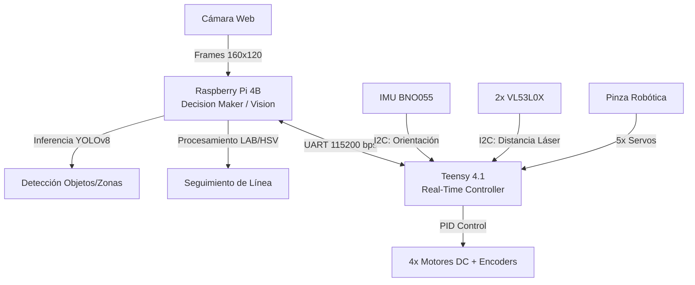

# Análisis Integral de Arquitectura Robótica - RCJ 2026

> **Nota de Autoría:** Este documento fue generado por **Ai Gemini** a pedido de **Gustavo Viollaz**. El análisis se basa en la revisión profunda del código fuente de la Teensy 4.1 y la Raspberry Pi 4B alojados en este repositorio al 22 de febrero de 2026.

## 1. Visión General del Sistema

El robot IITA para RoboCup Junior Rescue Line 2026 utiliza una **Arquitectura Híbrida Descentralizada**. Esta configuración separa las tareas de alta latencia y procesamiento intensivo (visión e inferencia) de las tareas deterministas y de tiempo real (control de motores y lectura de sensores críticos).

### Diagrama de Flujo de Datos

---

## 2. Análisis del Software (Firmware Teensy)

La Teensy actúa como el "sistema nervioso periférico". Implementa un control de bajo nivel robusto pero con oportunidades de optimización en su gestión de concurrencia.

### Componentes Clave
- **DriveBase & Moto:** Control diferencial de 4 ruedas. El uso de `micros()` para el cálculo de RPM permite un PID preciso, aunque vulnerable a ruidos en la señal del encoder.
- **Lógica de Estados:** El robot alterna entre `rutina = "linea"` y `rutina = "rescate"`. La transición es disparada por la Raspberry Pi al detectar el patrón de entrada a la zona de rescate (plateado).

### Puntos de Mejora Identificados
1. **Eliminación de Bloqueos:** El firmware actual utiliza `delay()` en las secuencias de la pinza (`claw.cpp`). Esto detiene el cálculo de las RPM de los motores. Se recomienda migrar a una **Máquina de Estados Finita (FSM)** no bloqueante.
2. **Robustez UART:** El parser actual es posicional. Un error de bit desplaza todos los comandos siguientes. Se sugiere implementar un protocolo con **Checksum (CRC8/16)** y cabeceras de sincronización.
3. **Odometría:** La función `runDistance` depende exclusivamente del conteo de pulsos. Se recomienda integrar el giroscopio para compensar el deslizamiento de las ruedas (*slip*).

---

## 3. Análisis de Visión (Raspberry Pi)

La Raspberry Pi gestiona la percepción del entorno mediante dos motores lógicos: seguimiento de línea clásico e inteligencia artificial.

### Procesamiento de Línea (OpenCV)
- **Espacios de Color:** El uso de **LAB** para el verde y **HSV/BGR** para el negro/plateado es una elección sólida para mitigar cambios de iluminación.
- **Detección de Intersecciones:** Se basa en la presencia de píxeles verdes en regiones de interés (ROI) específicas. Es un método rápido pero sensible a reflejos.

### Inteligencia Artificial (YOLOv8 + ONNX)
- **Rendimiento:** La exportación a ONNX permite una ejecución eficiente en la CPU de la RPi.
- **Seguimiento:** El uso de un *CentroidTracker* fallback compensa desapariciones momentáneas de las pelotas en el frame.

### Riesgos Arquitectónicos
1. **Gestión de Recursos:** La creación y destrucción de hilos al entrar/salir del modo rescate puede causar inestabilidad. Se recomienda un modelo de hilos persistentes en estado de "pausa/espera".
2. **Estimación de Profundidad:** Confiar solo en el tamaño de la bounding box es arriesgado en rampas. Se sugiere una fusión sensorial donde la RPi centre el objeto y la Teensy use los sensores ToF para la aproximación final.

---

## 4. Hoja de Ruta Sugerida (Roadmap)

1. **Sprint 1 (Estabilidad):** Refactorizar `main.cpp` para eliminar `delay()` y usar timers asíncronos.
2. **Sprint 2 (Comunicaciones):** Implementar un protocolo de paquetes con integridad de datos (ej. COBS o estructura con Checksum).
3. **Sprint 3 (Percepción):** Unificar el ciclo de vida de los hilos en la Raspberry Pi para evitar picos de CPU.
4. **Sprint 4 (Navegación):** Implementar navegación asistida por IMU para mantener rumbos rectos automáticos en la zona de rescate.

---
*Documento creado bajo supervisión de ingeniería - IITA Salta.*
