# ROBOCUPJUNIOR RESCUE LINE 2026
# TEAM DESCRIPTION PAPER

**Team Name:** RescueBot IITA  
**Robot Name:** Jesus  
**Institution:** IITA - Instituto de Innovacion y Tecnologia Aplicada  
**Country:** Argentina  
**Members:** Lucio Saucedo, Benjamin Villagran, Laureano Monteros  
**Mentor / coach support:** Enzo Juarez, Gustavo Viollaz  
**Contact:** rescuebot.salta@gmail.com

## Abstract

RescueBot IITA is a fully autonomous RoboCupJunior Rescue Line robot designed to complete the whole mission reliably: line following, green-marker decisions, obstacle handling, rescue-zone entry, victim collection, victim sorting, evacuation-zone deposit, and exit behavior. The robot is built around a dual-controller architecture. A Raspberry Pi 4B performs camera processing, high-level state decisions, and object detection, while a Teensy 4.1 handles deterministic motor control, sensors, servos, serial parsing, and safety routines.

The robot combines a custom Fusion 360 3D-printed chassis, four encoder motors, a five-servo rescue mechanism, a custom PCB, separated power rails, a wide-angle camera, ToF and ultrasonic distance sensors, a BNO055 IMU, and APDS9960 floor sensing. Its main competitive advantage is integration: classical vision is used for fast line and marker decisions, an exported AI detector supports rescue and deposit tasks, and the Teensy continues to manage low-level movement and fail-safe behavior even when the Raspberry Pi is under heavy vision load.

The design was developed through iterative testing from the team's earlier prototypes and 2025 competition experience. For 2026, the team focused on robustness, maintainability, documented testing, and evidence-based improvements.

## 1. Introduction

### a. Team

**Lucio Saucedo - Line-following vision and camera processing.** Lucio works mainly on the Raspberry Pi line-following pipeline, including camera processing, black-line tracking, green-marker detection and red/silver visual states. His work supports the robot's reliable behavior on the line course before entering the rescue zone.

**Benjamin Villagran - Raspberry Pi integration, AI and electronics.** Benjamin works on the integration between the Raspberry Pi and Teensy, the rescue-zone AI pipeline, model training/export, TFLite deployment, anti-flash/AGCWD preprocessing, PCB documentation, power distribution and Raspberry Pi deployment.

**Laureano Monteros - 3D design, Teensy firmware and rescue mechanism.** Laureano works on the robot's 3D/CAD design, printed mechanical structure, rescue mechanism, and C++/Arduino firmware for the Teensy 4.1. His work includes motor control, sensor acquisition, serial parsing, encoder movements, IMU turns, and claw/deposit routines, making the high-level decisions executable on the physical robot.

Although each member has a main area, the robot was developed collaboratively: the final behavior depends on constant integration between line vision, AI, firmware, electronics and mechanical testing.

**Figure 1: Robot evolution from first prototype to national championship robot**

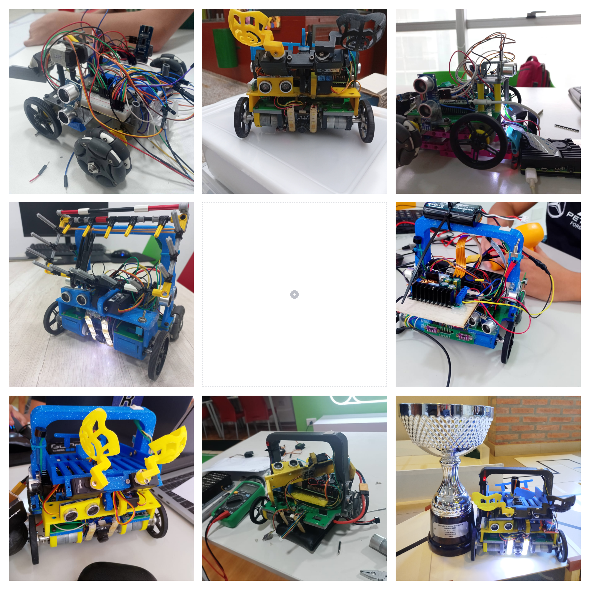

The team's history is an important part of the design. The robot evolved from a simple first-year platform into a compact 2025 competition robot with a custom rescue mechanism and integrated electronics. One week before a national competition, a major hardware failure forced the team to disassemble and rebuild the robot in a very short time. That experience changed the 2026 plan: modular parts, clearer wiring, PCB documentation, and reliability gates became design requirements instead of optional improvements.

## 2. Project Planning

### a. Overall Project Plan

The objective for 2026 is to build a robot that can complete Rescue Line consistently instead of only solving isolated tasks. The team defined requirements from the 2026 rules, the rescue-zone constraints, past national competition experience, and the short time available before the world competition.

**Table 1: Requirements, competition basis and final design solutions**

| Requirement | Rule / challenge basis | Tools / components | Final solution |
|---|---|---|---|
| Follow black lines, curves, gaps and intersections | Rescue Line track navigation requires continuous line recovery, gap handling and intersection decisions. | Wide USB camera, Raspberry Pi 4B, OpenCV | The Raspberry Pi processes a 160x120 camera image, extracts the black line, computes a steering angle, and sends speed/angle commands to the Teensy. |
| Detect green markers and red stop lines | Green markers and red stop markers change the robot action at intersections and transitions. | LAB/HSV masks, RPi state logic, Teensy action cases | The camera pipeline detects green markers and red lines, then encodes them as `green_state` commands for left, right, double-green, and stop behavior. |
| Avoid obstacles without losing the route | Obstacle recovery must happen without losing the original route after the bypass. | 3x HC-SR04 ultrasonic sensors, IMU turns | The Teensy detects close obstacles and executes controlled avoidance turns using BNO055 yaw feedback. |
| Detect rescue-zone entry | Silver/plateado entry must trigger the rescue behavior instead of normal line following. | Silver mask, APDS9960 color sensing, state transition bytes | The robot can transition from line mode to rescue mode when silver/plateado is detected by vision or floor sensing. |
| Search and collect victims | Evacuation-zone scoring depends on locating victims, approaching them and physically collecting them. | Exported AI detector, camera tracking, ToF/ultrasonic wall behavior, five-servo claw | The Raspberry Pi selects targets and the Teensy executes approach, pickup, sorting and storage routines. |
| Sort victims and deposit into correct zones | Victim type and deposit-zone color determine where each victim must be released. | Claw sorter, deposit servo, red/green zone detection, FCL/FCR limit switches | Victims are separated mechanically and released left or right after physical wall alignment. |
| Survive lighting variation and 2026 LED-wall effects | The 2026 LED-wall condition allows strong white light near the evacuation walls, causing mixed over/underexposure in one frame. | Anti-flash preprocessing, AGCWD normalization, APDS9960 hardware path | Software preprocessing and local floor sensing reduce dependence on a single visual threshold. |
| Remain safe under crashes or switch-off | Competition runs need visible stop behavior and recovery from communication or state failures. | Physical start switch, UART stop byte, global Python recovery, firmware timeouts | The robot sends/receives stop states, stops motors on switch-off, and avoids infinite movement loops through timeout guards. |
| Be repairable during competition | Short repair windows make serviceability a non-functional requirement, not only a convenience. | Modular 3D prints, custom PCB, documented power tree, accessible battery/electronics | The structure and electronics are organized to allow rapid inspection and replacement between runs. |

The project schedule was built around progressive integration: first mechanical and electronics stability, then line-following, then rescue behavior, and finally reliability tests and documentation.

**Table 2: Development schedule and gates**

| Period | Milestone | Main owner(s) | Gate / review condition |
|---|---|---|---|
| 2023 | First functional prototype | Whole team | Basic line following and first pickup concept validated. |
| 2024 | Full mechanical redesign | Laureano + team review | Fusion 360 CAD assembled, printable modules exported, drivetrain stable. |
| 2024 | Electronics and PCB integration | Benjamin | Main PCB, power distribution and sensors documented and connected. |
| 2025 | Raspberry Pi + Teensy integration | Benjamin + Lucio + Laureano | UART protocol works and robot can switch between waiting, line and rescue states. |
| 2025 | Rescue AI model path | Benjamin + team review | First victim and deposit-zone detector connected to the rescue behavior. |
| 2025 | National competition learning | Whole team | Failures from real runs converted into GitHub issues and redesign priorities. |
| May 2026 | Priority reliability sprint | Laureano + Lucio + Benjamin | Timeouts, serial validation, headless recovery, systemd restart and bench tests reviewed. |
| June 2026 | Final documentation sprint | Whole team + mentor review | TDP, BOM, poster/video assets, TEST_LOG and final PDF exported in official template. |

**Visual Gantt timeline for Table 2**

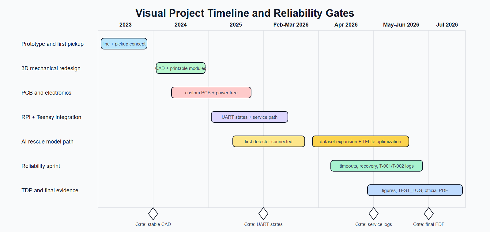

This order was chosen because each layer depends on the previous one. The team cannot tune rescue behavior without a stable drivetrain and reliable serial protocol, and it cannot claim performance reliability without a test log that records failures and fixes.

### b. Integration Plan

The robot is integrated as a distributed control system. The Raspberry Pi makes perception and high-level decisions; the Teensy executes time-critical motion and safety tasks.

**Figure 2: System integration plan**

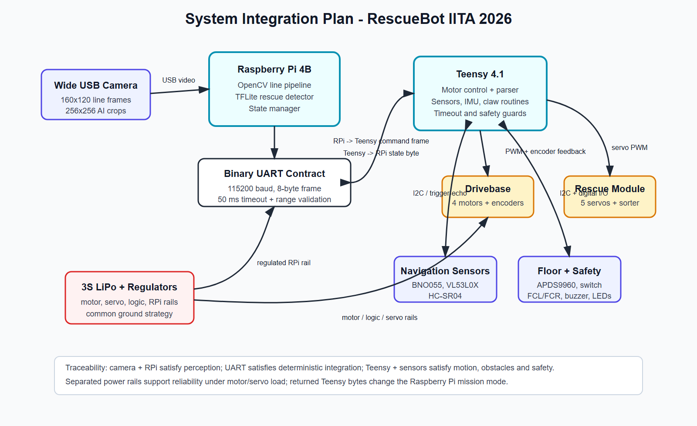

**Interface map for Figure 2**

| Interface | Direction | Protocol / rate | Payload / signal | Requirement supported |
|---|---|---|---|---|
| Camera to Raspberry Pi | Camera -> RPi | USB video stream | 160x120 line frames and 256x256 AI crops | Line tracking, markers, rescue perception. |
| Raspberry Pi to Teensy | RPi -> Teensy | UART, 115200 baud, 50 ms timeout | 8-byte frame: speed, angle, `green_state`, silver flag | Deterministic integration between perception and motion. |
| Teensy to Raspberry Pi | Teensy -> RPi | UART status byte | `0xF9` ready, `0xF1` rescue, `0xF8` rescue done, `0xF7` evacuation, `0xFF` stop | Safe state transitions and recovery. |
| Teensy to drivebase | Teensy -> motors, encoders -> Teensy | PWM, direction pins, encoder interrupts | Motor effort, direction and encoder feedback | Line following, obstacle bypass, calibrated distance moves. |
| Teensy to rescue module | Teensy -> servos | Servo PWM | Claw, lift, sort, right deposit, left deposit | Pickup, sorting and deposit. |
| Teensy to navigation sensors | Bidirectional | I2C and trigger/echo | BNO055 yaw, VL53L0X distance, HC-SR04 distance | Turns, wall approach, obstacle detection. |
| Teensy to floor/safety modules | Bidirectional / digital input | I2C and digital I/O | APDS9960 floor readings, switch, FCL/FCR, LEDs, buzzer | Silver/floor confirmation, physical alignment and stop behavior. |

**Table 3: Component-to-requirement integration**

| Component | Communication / interface | Requirements satisfied |
|---|---|---|
| Raspberry Pi 4B | USB camera, UART to Teensy | Line tracking, marker decisions, rescue target selection, state management. |
| Teensy 4.1 | UART from RPi, PWM, I2C, digital I/O, interrupts | Real-time motors, sensors, claw, stop behavior and movement sequences. |
| Custom PCB | Power and signal routing | Serviceability, compact wiring, stable integration of sensors and actuators. |
| Camera | USB video stream | Black line, green markers, red line, silver detection, rescue objects and zones. |
| Distance sensors | HC-SR04 and VL53L0X read by Teensy | Obstacle detection, wall following and rescue-zone alignment. |
| BNO055 IMU | I2C | Controlled turns, yaw reset, ramp/pitch-based speed adaptation. |
| Five-servo claw | PWM from Teensy | Pick, lift, sort, store and deposit victims. |

The RPi-to-Teensy frame is intentionally small:

```text
[0xFF, speed, 0xFE, angle, 0xFD, green_state, 0xFC, silver_line]
```

Teensy sends state bytes back to the Raspberry Pi, including ready (`0xF9`), rescue (`0xF1`), rescue done (`0xF8`), evacuation (`0xF7`) and stop (`0xFF`). This keeps the robot synchronized without a complex network stack.

## 3. Hardware

The hardware is fully custom and organized around three goals: stability on the course, serviceability between runs, and clear separation between sensing, computation, power and actuation.

**Figure 3: Hardware overview**

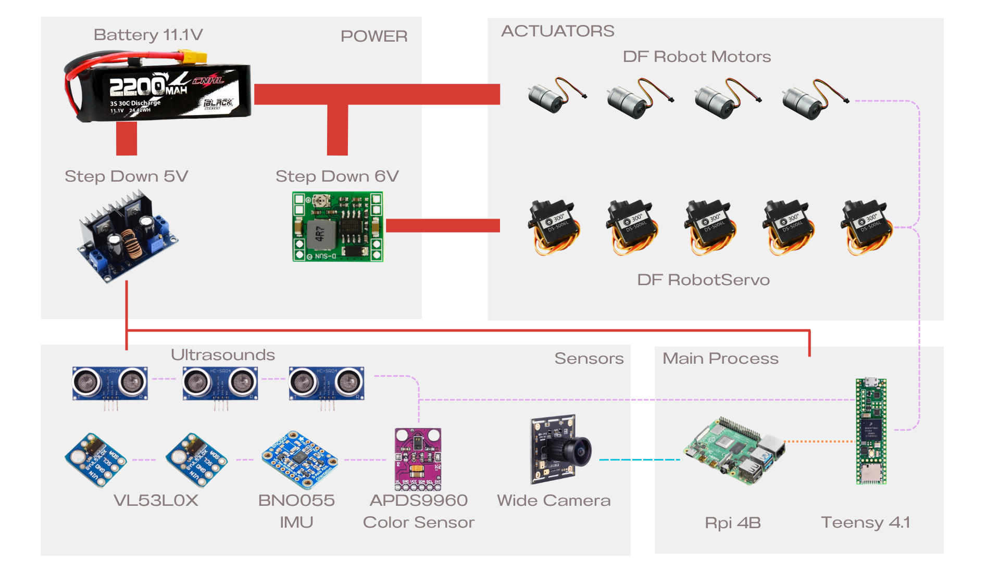

The hardware overview shows how the battery, regulators, motors, servos, sensors, Raspberry Pi and Teensy are grouped into functional blocks. This diagram is used by the team to explain the robot quickly before moving into CAD and PCB-level details.

**Figure 4: Mechanical CAD reference views**

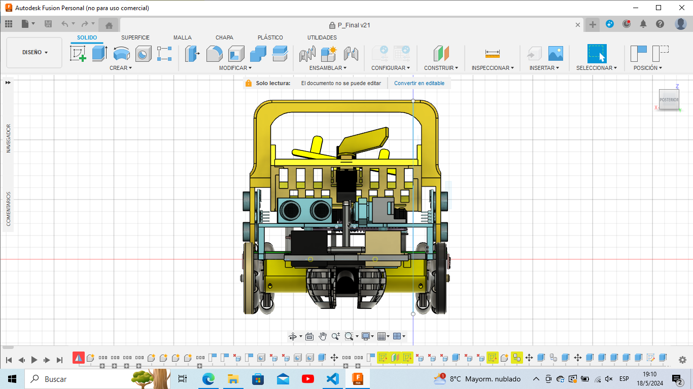
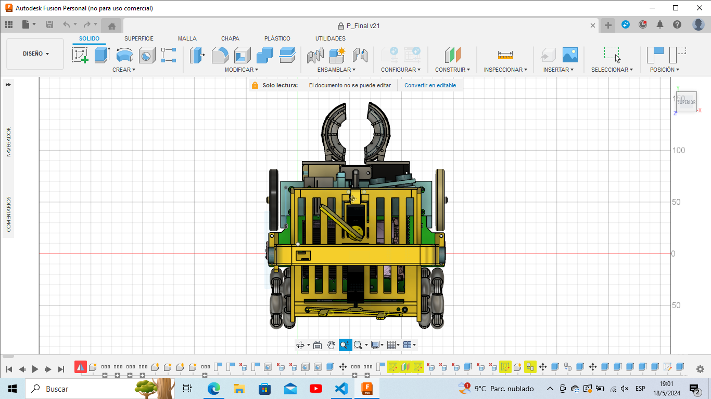
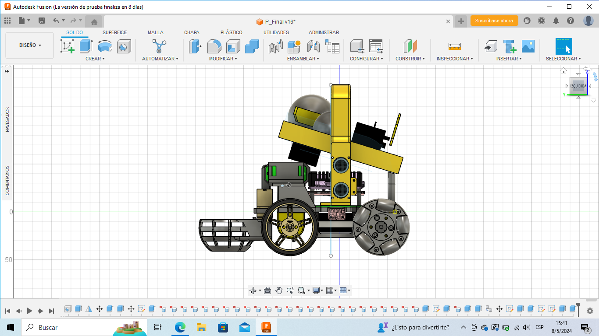

### a. Mechanical Design and Manufacturing

The structure was designed in Fusion 360 and manufactured as multiple 3D-printed modules. The CAD package includes editable files, STL exports and orthogonal robot views. The current CAD documentation lists the assembly parts and screw count, which makes the robot easier to rebuild after transport or competition damage.

The lower level contains the drivetrain: four 12 V DC motors with encoders, fixed wheels and omniwheels. The design keeps the battery and motors low to reduce the center of gravity, which is important for ramps, seesaws and abrupt turns. The middle level supports electronics and wiring. The front/upper area holds the camera and rescue mechanism, while the rear/upper path handles storage and deposit.

The rescue mechanism is the most important mechanical subsystem. It uses five servos: two grippers, one lift servo, one sorting servo and one deposit servo. Separating these functions makes calibration easier because gripping, lifting, sorting and releasing can be tuned independently. The mechanism stores victims in an inclined path and uses a deposit servo to release them toward the selected side.

**Table 4: Mechanical submodules**

| Submodule | Function | Design reason |
|---|---|---|
| Drivebase | Four driven encoder motors with differential steering | Provides traction and controlled movement while preserving simple kinematics. |
| Camera mount | Keeps the wide camera fixed relative to the chassis | Makes visual calibration repeatable. |
| Five-servo claw | Grabs, lifts, sorts and releases victims | Allows victim handling without a large conveyor or complex mechanism. |
| Storage/deposit path | Separates collected victims and releases left/right | Supports scoring strategy while keeping the robot compact. |
| Sensor mounts | Hold ToF, ultrasonic and color sensors in fixed positions | Reduces calibration drift and protects sensors during runs. |
| Electronics layer | Holds Raspberry Pi, Teensy, PCB and wiring | Improves service access and separates electronics from the claw path. |

Reliability testing for the mechanical system is organized around the failures that lose the most points: line drive repeatability, ramp stability, pickup success, storage retention and deposit alignment. The drivetrain distance scale was first calculated from the kinematic model: a 60 mm wheel and 540 ticks/rev give `pi x 60 / 540 = 0.3491 mm/tick`, equivalent to 28.65 ticks/cm. On the physical robot, repeated movement calibration led the team to use 25 counts/cm in `runDistance()`. This calibrated value compensates for the real drivetrain behavior instead of relying only on the ideal geometry. The team uses actuator tests in `software/teensy/firmware/test/actuators/` and records final physical results in `testing/TEST_LOG.md`.

**Table 5: Mechanical validation procedures**

| Test | Procedure | Criterion |
|---|---|---|
| Straight movement | Run encoder-based `runDistance()` at fixed distances using the calibrated 25 counts/cm scale | Robot stops consistently without encoder stall and measured distance error is recorded. |
| Turning | Run 45, 90 and 180 degree `runAngle()` movements | Final yaw is within the accepted competition tolerance. |
| Pickup | Repeat black and silver victim pickup from multiple approach offsets | Victim is captured, lifted and sorted without falling. |
| Deposit | Align with FCL/FCR limit switches and release left/right | Robot aligns physically before deposit and the servo returns to center. |
| Ramp and shock | Run over ramp/rough surfaces and inspect printed modules | No structural crack, loose screw or drivetrain failure. |

The first physical measurement session recorded in `testing/TEST_LOG.md` confirms that `runDistance()` is repeatable enough for the current TDP evidence: short distances showed approximately 1 cm error, while longer distances showed approximately 1-2 cm error. `runAngle()` also stopped within the observed 1 degree target tolerance.

The innovative mechanical solution is the compact five-servo rescue module. It gives the team a competitive advantage because the robot can collect, sort and deposit victims with a mechanism that remains printable, repairable and lightweight.

### b. Electronic Design and Manufacturing

The electronic architecture is centered on a Raspberry Pi 4B and a Teensy 4.1. The Raspberry Pi handles high-level processing and camera work; the Teensy handles real-time sensor and actuator control. The system also includes a custom PCB, a 3S LiPo battery, regulated power rails, an XT60 connector, motor drivers, five servos, three HC-SR04 ultrasonic sensors, two VL53L0X ToF sensors, one BNO055 IMU, one APDS9960 color/proximity sensor, a buzzer, LEDs, a relay output and physical switches.

**Figure 5: Custom PCB layout and schematic**

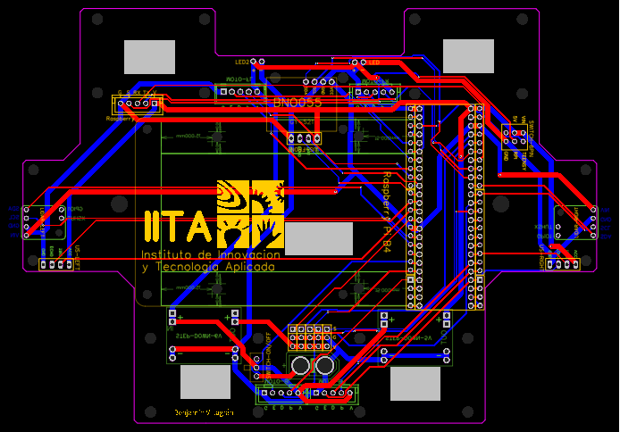


The custom PCB and schematic make the electronic interfaces explicit: power input, regulated rails, Teensy pinout, Raspberry Pi UART, motor outputs, servo outputs, APDS9960, BNO055, ultrasonic sensors, VL53L0X sensors, indicators, relay and switches. This is stronger than only listing parts because the judge can see how the system is actually integrated.

**Figure 6: Power and electronics integration**

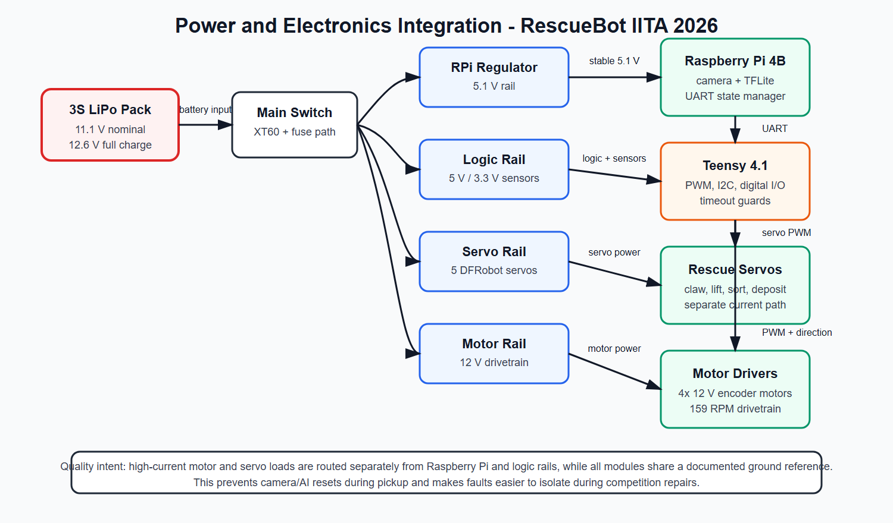

The PCB evidence is stored in `hardware/electronics/PCB_Main/`, including the schematic PDF, PCB preview and board source file. The power-tree document describes the intended separation between motor, logic, Raspberry Pi and servo rails. This separation is important because camera processing and motor/servo current spikes happen at the same time during rescue.

The drivetrain uses four 12 V DFRobot motors rated at 159 RPM with integrated encoder feedback. The field-calibrated encoder scale is 25 counts/cm, derived from the theoretical kinematic model of 28.65 ticks/cm (`pi x 60 mm / 540 ticks/rev`) and corrected on the physical robot. The IMU-based turn routine stops when yaw error is within +/-1.0 degree. The five DFRobot SER0056 clutch servos use a 540-2390 us pulse range over 274 degrees in the firmware, and the component specification includes electronic shutoff after 5 s of blockage.

**Table 6: Electronic submodules**

| Submodule | Components | Function |
|---|---|---|
| Main compute | Raspberry Pi 4B | Vision, AI inference path, high-level robot states and serial output. |
| Low-level controller | Teensy 4.1 | Motors, sensors, servos, parser, safety and deterministic routines. |
| Vision | Wide USB camera | Main perception source for line, markers, rescue objects and zones. |
| Navigation sensors | BNO055, VL53L0X, HC-SR04 | Yaw turns, ramp behavior, obstacle detection and wall behavior. |
| Floor and exit sensing | APDS9960 and controlled light path | Confirms floor colors and supports black/silver exit behavior. |
| Power subsystem | 3S LiPo, regulators, PCB, XT60 | Supplies separated loads and simplifies wiring. |

Electronic quality assurance is based on bench validation before full robot runs: rail voltage checks under servo load, sensor boot checks, serial frame tests, switch-off tests and connector inspection. The official 2026 BOM export uses the current hardware source in the repository; at the time of this draft, the PCB BOM lists a 3S 11.1 V 2200 mAh LiPo.

The initial battery measurement session started at 12.6 V. After 5 minutes powered on at rest, the pack measured 12.5 V. In continuous operation, the robot ran for approximately 1 hour until reaching 10.5 V. A high-stress check with the full program, motors at `speed = 60` and pickup movement was also run for 10 minutes; the final voltage for that stress case still needs to be recorded precisely before the final PDF.

The main electronic innovation is the custom PCB-centered architecture. Instead of a loose breadboard-style wiring layout, the robot uses an integrated board and documented power distribution so that sensors, actuators and controllers can be inspected quickly and consistently.

## 4. Software

### a. General Software Architecture

The software is split by timing requirements. The Raspberry Pi runs Python with OpenCV, NumPy, serial communication, camera threads and the exported detector path. The Teensy runs Arduino/C++ firmware with motor, sensor, serial and claw control.

**Figure 7: General software flow diagram**

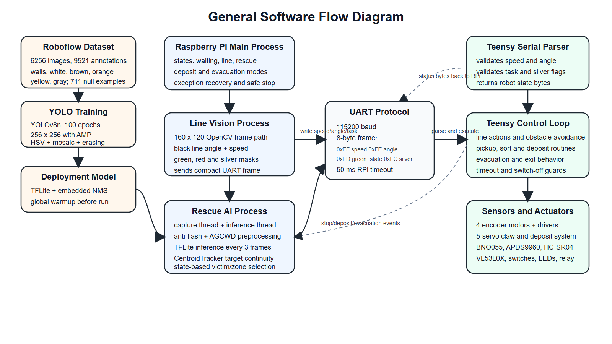

**Figure 8: Line following decision flow diagram**

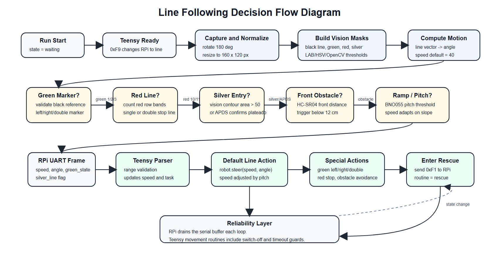

**Figure 9: Rescue and evacuation flow diagram**

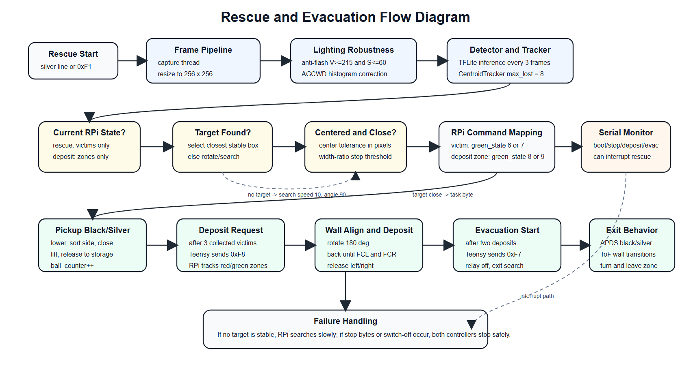

The diagrams above are drawn from the current `Main.py` and `main.cpp` behavior. Figure 7 shows process ownership and data flow between dataset training, Raspberry Pi processes, UART and Teensy firmware. Figure 8 expands line mode: OpenCV masks produce speed, angle, green-marker, red-line and silver-entry commands, then the Teensy chooses between normal steering, obstacle avoidance, green turns and rescue entry. Figure 9 expands rescue/deposit/evacuation behavior: the detector and tracker select stable targets, the Raspberry Pi maps target classes into task bytes, and the Teensy performs pickup, sorting, wall alignment, deposit and exit behavior.

Line following is done with classical vision because it is fast and predictable. The robot rotates and resizes the frame, computes masks for black, green, red and silver, estimates a steering angle from the black line, and sends a compact UART frame to the Teensy. Green and red detections are encoded as state commands, while silver detection starts rescue behavior.

The confirmed production parameters are extracted from the codebase. The vision pipeline captures frames at 160 x 120 px using a 140 degree wide-angle USB camera. The AI detector uses a 256 x 256 px input every 3 camera frames, with confidence thresholds of 45% for `negro`, 45% for `plateado`, 50% for `rojo alto`, and 60% for `verde_alto`. The Raspberry Pi to Teensy UART link runs at 115200 baud with an 8-byte frame and a 50 ms serial timeout.

Rescue mode uses a 256x256 exported detector path and tracking logic. The current production branch initializes a TFLite interpreter globally and warms it up before rescue mode, while ONNX/NCNN artifacts remain in the repository as model export history. The deployed model file and runtime are recorded with the final Raspberry Pi image so that code, documentation and competition setup stay synchronized.

The Teensy firmware parses the serial frame, validates ranges, updates speed/steer/task variables, and executes movement routines. Encoders support distance movement, the BNO055 supports yaw turns, and the APDS9960 supports floor color classification. The firmware also includes timeout guards and visible failure behavior so that a sensor problem does not silently trap the robot in a movement loop.

**Table 7: Software modules and tools**

| Module | Tools / files | Function |
|---|---|---|
| Camera capture | `camthreader.py` | Keeps the latest camera frame available without blocking processing. |
| Line vision | `Main.py` with OpenCV/NumPy | Black line, green markers, red line and silver detection. |
| Rescue detector | TFLite/YOLO-family exported model path | Victim and zone target selection. |
| UART protocol | `Main.py`, `serialEvent5()` | RPi-to-Teensy synchronization. |
| Motion control | `drivebase` library | Motor PWM, direction and encoder pulse use. |
| Rescue mechanism | `claw` library and firmware routines | Pickup, sorting, storage and deposit actions. |
| Safety/recovery | global Python loop, switch handling, firmware timeouts | Stop, restart and degraded behavior. |

### b. Innovative Solutions

#### Innovation 1: Hybrid classical + AI perception

Classical image processing handles line following at full camera speed because it is deterministic and fast to debug. AI detection is reserved for the rescue zone, where color masks and circle detection fail under variable lighting. This separation means the robot never pays the cost of AI inference during line following.

The AI dataset was also updated because the 2026 evacuation-zone walls may use colors outside the neutral walls used in earlier practice fields. The 2026 rules allow evacuation-zone walls of any color except the semantic colors red, green and black, and committee discussion explicitly notes that bright orange walls are within the expected adaptation range. The team observed a concrete failure case: with a fluorescent orange wall, the detector could confuse the wall with the red deposit zone, which affected black-victim deposit behavior. This was classified as a dataset distribution problem rather than a code bug.

The current Roboflow dataset snapshot contains 6256 images, 9521 annotations, 711 null examples, and 0 missing annotations across four deployed classes: `plateado` 3029, `negro` 2488, `verde_alto` 2147, and `rojo_alto` 1857. White, light-brown, orange, yellow and gray wall conditions are now recorded and annotated; the green-zone-with-black-victims scenario is still in progress for the final training branch.

The training configuration was chosen for the same robustness goal. The team trained from `yolov8n.pt` for 100 epochs at 256 x 256 px with AMP enabled. Color augmentation was deliberately aggressive for saturation and brightness (`hsv_s=0.7`, `hsv_v=0.8`) to simulate washed-out colors, strong LED reflections and backlight, while hue shift stayed low (`hsv_h=0.015`) so red and green semantic classes would not be randomly swapped. Geometric augmentation used moderate rotation, translation, scale and shear, and robustness augmentation used mosaic, mixup, copy-paste and erasing. Kaggle validation of the best weights reached 0.971 precision, 0.929 recall, 0.932 mAP50 and 0.767 mAP50-95 over 224 validation images and 427 instances. Per-class validation remained strong for `negro` (mAP50 0.995), `plateado` (0.904), `rojo_alto` (0.929) and `verde_alto` (0.898). In team tests, this configuration kept black and silver victim detections separated under strong flashlight-style illumination and improved detection of the high red/green deposit zones against the recorded wall colors.

Measured evidence and figure reference: Table 9 records the 160 x 120 px line-vision path, the 256 x 256 px detector path, and the every-3-frames detector cadence. Figures 7, 8 and 9 show the separation between line mode, rescue detection, deposit and evacuation logic. Dataset evidence is stored in `docs/tdp/roboflow-dataset-status-2026-05-23.md`.

#### Innovation 2: TFLite migration with embedded NMS and global warmup

The rescue detector was originally deployed using the ultralytics ONNX runtime. Profiling on the competition hardware (Raspberry Pi 4B 8GB) showed this was the main speed bottleneck in rescue mode.

The team migrated to a TFLite interpreter with the NMS postprocessing step embedded directly in the exported model (export flag `nms=True`), eliminating the Python-side NMS overhead. TFLite uses the XNNPack delegate with ARM NEON kernels optimized for Cortex-A72, giving a structural advantage over ONNX Runtime on this CPU.

**Measured result on Raspberry Pi 4B:**

| Configuration | FPS on Pi 4B |
|---|---:|
| ONNX + ultralytics | ~7 FPS |
| TFLite + NMS embedded | ~18 FPS |
| Improvement | +157% same model, same weights |

**Figure 10: FPS comparison - ONNX (left, 7.14 FPS) vs TFLite with AGCWD (right, 18.10 FPS)**

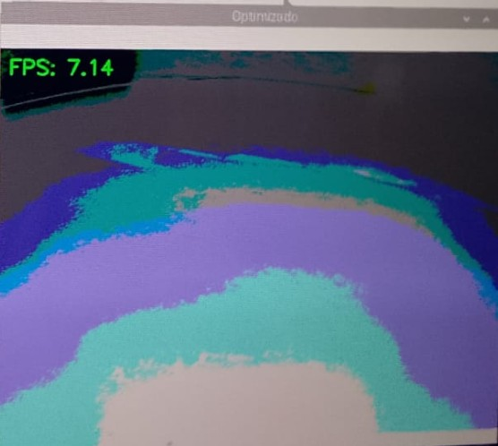

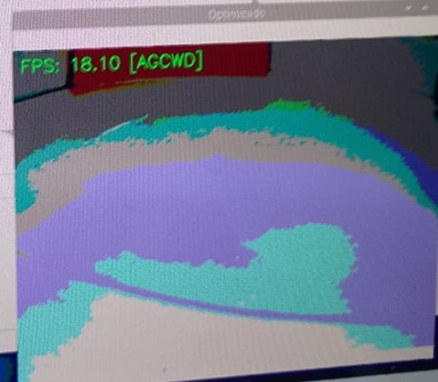

A global warmup was added: at program startup, a 256 x 256 black dummy image is run through the interpreter before any competition task begins. This eliminates the JIT compilation spike on the first real inference.

**Measured warmup effect (Raspberry Pi 4B):**

| Mode | First inference (PRED[0]) | Avg inference |
|---|---:|---:|
| Without warmup | 177.7 ms | 38.7 ms |
| With warmup | 67.0 ms | 50.6 ms |
| Improvement | -62% latency spike | stable |

The robot also uses `DETECT_EVERY=3` with a CentroidTracker that maintains victim position between inference frames, preserving tracking continuity without running the full detector on every frame.

Measured evidence and figure reference: Figure 10 shows the measured ONNX and TFLite FPS screenshots from the Raspberry Pi 4B.

#### Innovation 3: Anti-flash + AGCWD preprocessing for 2026 LED wall rule

RoboCup 2026 introduced a new rule (section 3.9) allowing organizers to mount white LED flashlights perpendicular to the evacuation zone walls. This creates simultaneous overexposed and underexposed regions in the same frame, which defeats fixed-threshold color detection.

Before AGCWD, the Raspberry Pi applies `anti_flash_preprocess()`, a highlight-compression stage designed specifically for LED flashlight glare. The function detects destructive flash pixels in HSV space with `V >= 215` and `S <= 60`, so it targets saturated white/gray glare rather than every bright object. The binary flash mask is softened with a 5 x 5 Gaussian blur, then the value channel is compressed with:

```text
V_out = 215 + (V_in - 215) x 0.45
```

under the soft alpha mask. For example, a fully saturated pixel at `V=255` is reduced to about `V=233`, which keeps it bright but removes the histogram spike that would otherwise destabilize AGCWD. This does not reconstruct information hidden by the flash; it prevents the flash from creating hard borders and false-positive artifacts before the detector runs.

The team implemented AGCWD (Adaptive Gamma Correction with Weighting Distribution, Huang et al., IEEE TIP 2013, DOI: 10.1109/TIP.2012.2226047). Unlike fixed gamma correction, AGCWD computes a different gamma curve for each intensity level based on the actual frame histogram:

```text
LUT[i] = 255 x (i/255)^(1 - w_cdf[i])
```

where `w_cdf` is the weighted CDF of the histogram. Dark pixels receive aggressive correction; bright pixels are left nearly unchanged. When the frame is already well-lit (`mean_v > 120`), the curve blends 30% AGCWD with 70% identity to avoid over-processing.

Computational cost: ~1-2 ms per frame on Pi 4B using `cv2.LUT` (vectorized, no Python loops).

Techniques evaluated before selecting AGCWD:

- Fixed gamma: does not adapt to intra-frame lighting variation.
- CLAHE: improves local contrast but amplifies noise in dark regions.

AGCWD was selected because it adapts per-pixel, costs under 2 ms, and does not require parameter tuning per environment. In the current code, anti-flash runs before AGCWD both on detector frames and on intermediate rescue frames, so the tracker sees stable enhanced frames even when full AI inference is skipped.

Measured evidence and figure reference: Figure 10 shows the TFLite + AGCWD run at 18.10 FPS, supporting that the preprocessing remains fast enough for rescue-mode perception. The exact anti-flash thresholds and AGCWD blend are extracted in `testing/TEST_LOG_AUTO.md`.

#### Innovation 4: Reliability over premium components

Most teams in the competition use a Google Coral USB Accelerator and Raspberry Pi 5. The team chose to optimize software on a Raspberry Pi 4B 8GB instead, achieving ~18 FPS in rescue mode through runtime selection (TFLite over ONNX), embedded NMS, and frame-skip tracking - without any dedicated AI accelerator hardware.

This decision was deliberate: the robot is easier to repair and replace during competition, and the software optimizations are documented and reproducible. A hardware failure on a Coral USB during a run would be unrecoverable; a software regression can be rolled back from the repository.

The same reliability philosophy applies to the binary UART protocol (8 bytes, 115200 baud, 50 ms timeout, range validation) and the firmware timeout guards: the system is designed to fail visibly and recover, not to fail silently.

Measured evidence and figure reference: Figure 2 shows the distributed Raspberry Pi + Teensy system design, and Figure 10 shows that the optimized Pi 4B software path reaches rescue-mode FPS without a dedicated AI accelerator.

## 5. Performance Evaluation

The team evaluates performance by adding challenges to the test course without removing earlier ones. This prevents a new fix from improving one task while breaking a previous task. The main categories are line course reliability, obstacle handling, ramp behavior, rescue entry, victim pickup, deposit alignment, evacuation exit, power stability and crash recovery.

**Table 8: Performance evaluation plan**

| Challenge | Measurement | Development impact |
|---|---|---|
| Line following | loop FPS, line-loss events, green-marker decisions | Tune camera resolution, thresholds and speed. |
| Rescue detection | detector FPS, false positives, centered-target behavior | Select final model/runtime and confidence thresholds. |
| Dataset wall-color robustness | false positives on colored walls, per-class detections, null examples | Retrain with white, light-brown, orange, yellow and gray wall examples; explicitly re-test orange-wall deposit behavior. |
| Movement routines | distance error, angle error, timeout occurrence | Validate the 25 counts/cm field calibration, IMU turns and fallback behavior. |
| Victim handling | pickup success, sorting success, accidental drops | Adjust claw angles, approach distance and storage timing. |
| Deposit | wall-alignment success, left/right release success | Tune FCL/FCR alignment and deposit servo positions. |
| Electronics | rail voltage under load, resets, serial frame counters | Improve wiring, regulator selection and connector strain relief. |

**Table 9: Confirmed system parameters from codebase and BOM**

| Parameter | Value | Source |
|---|---|---|
| Camera resolution | 160 x 120 px | `camthreader.py` |
| AI inference resolution | 256 x 256 px | `Main.py` |
| AI detection cadence | every 3 frames | `Main.py` |
| AI confidence thresholds | 45-60% by model class | `Main.py` |
| Anti-flash preprocessing | enabled; HSV `V>=215`, `S<=60`, value compression factor 0.45 | `Main.py` |
| AGCWD high-brightness blend | if mean V >120, 30% AGCWD LUT + 70% identity | `Main.py` |
| UART baud rate | 115200 baud | `Main.py` + `main.cpp` |
| UART frame size | 8 bytes | `Main.py` + `main.cpp` |
| Encoder scale, calibrated | 25 counts/cm | `main.cpp` + calibration notes |
| Theoretical encoder scale | 28.65 ticks/cm | kinematic model |
| IMU turn tolerance | +/-1.0 degree | `main.cpp` |
| Claw sequence step delay | 500 ms | `claw.cpp` |
| Obstacle trigger distance | 12 cm | `main.cpp` |
| Ramp speed threshold | pitch >10 degrees -> speed 30 | `main.cpp` |
| Battery | 3S 11.1 V 2200 mAh 30-60C | PCB BOM |
| Motors | 12 V 159 RPM encoder motors, x4 | PCB BOM |
| Servos | 2 kg 300 degree clutch servos, x5 | PCB BOM |

**Code-level reliability guards**

| Guard | Confirmed behavior | Source |
|---|---|---|
| RPi serial timeout | 50 ms read/write timeout | `Main.py` |
| RPi serial buffer drain | line loop drains all waiting bytes each iteration | `Main.py` |
| RPi rescue serial monitor | background thread can interrupt rescue on boot/stop/evacuation bytes | `Main.py` |
| TFLite warmup | 256 x 256 dummy inference before competition behavior | `Main.py` |
| Teensy priority fixes | master flag enables timeout, serial, sensor and recovery fixes | `priority_fix_flags.h` |
| UART payload validation | rejects out-of-range speed, angle, task and silver payloads | `main.cpp` |
| `runDistance()` guard | encoder motion has computed timeout and switch-off stop path | `main.cpp` |
| `runAngle()` guard | IMU turn has computed timeout and switch-off stop path | `main.cpp` |
| Sensor guards | APDS fresh timeout, ToF 500 ms timeout, visible init failures | `main.cpp` |

**Dataset robustness snapshot for final rescue-model training**

| Dataset metric | Current value |
|---|---:|
| Total images | 6256 |
| Total annotations | 9521 |
| Missing annotations | 0 |
| Null examples | 711 |
| Average annotations per image | 1.5 |
| Classes | 4 |
| Training base model | YOLOv8n, 100 epochs, 256 x 256 px |
| Key lighting augmentations | `hsv_s=0.7`, `hsv_v=0.8`, `erasing=0.4` |
| Key false-positive augmentations | `mosaic=1.0`, `mixup=0.1`, `copy_paste=0.1` |
| Kaggle validation set | 224 images, 427 instances |
| Overall validation precision / recall | 0.971 / 0.929 |
| Overall validation mAP50 / mAP50-95 | 0.932 / 0.767 |
| Class mAP50 values | `negro` 0.995, `plateado` 0.904, `rojo_alto` 0.929, `verde_alto` 0.898 |
| `plateado` annotations | 3029 |
| `negro` annotations | 2488 |
| `verde_alto` annotations | 2147 |
| `rojo_alto` annotations | 1857 |
| Annotated wall colors | white, light brown, orange, yellow, gray |

**Table 10: Initial physical and service measurements from T-001/T-002**

| Measurement | Result | Development meaning |
|---|---|---|
| Battery at start | 12.6 V | Confirms fully charged 3S pack before the test session. |
| Battery after 5 min idle | 12.5 V | Only 0.1 V drop while powered on at rest. |
| Continuous runtime | 1 h until 10.5 V | Supports the claim that the power system can survive long test/competition sessions. |
| High-stress run | 10 min with full program, motors at `speed = 60` and pickup sequence | Useful stress evidence; final voltage still needs exact recording. |
| `runDistance()` short-distance error | approximately 1 cm | Confirms the 25 counts/cm calibration is close on short movements. |
| `runDistance()` longer-distance error | approximately 1-2 cm | Error grows slightly with distance but remains small for course maneuvers. |
| `runAngle()` stop accuracy | stops at approximately 1 degree | Confirms the IMU turn routine reaches the intended yaw tolerance. |
| Line-following loop speed | 91.33 FPS over a 30 s service run | Measured from the real Raspberry Pi service, including camera read, resize, masks, steering, UART send and serial handling. |
| Rescue/deposit AI loop speed | 22.25-22.40 FPS | Measured from the service log with TFLite detector path, anti-flash/AGCWD preprocessing and tracking active. |
| Rescue-to-deposit transition | Teensy byte `0xF8` received as `248` | Confirms real Teensy -> Raspberry Pi state synchronization during a mission sequence. |

One significant difficulty has been robustness under variable lighting and variable wall colors. Reflections, LED effects and colored evacuation walls can affect black, green, red and silver masks or model detections. The team addressed lighting with anti-flash preprocessing, AGCWD brightness normalization, LAB/HSV color spaces, and an APDS9960 hardware sensing path for floor colors. The team addressed wall-color dataset shift by expanding the Roboflow dataset and annotating wall colors that previously caused failures, especially the orange-wall case that could be confused with the red deposit zone. Another important difficulty has been keeping the Teensy responsive during rescue actions. The response was to add serial buffer draining, range validation, timeout guards and a path toward non-blocking claw state machines.

The 2025 rebuild episode shown in Figure 1 became a practical reliability lesson. After the robot suffered a major failure shortly before competition, the team rebuilt the platform fast enough to compete and qualify internationally. For 2026, this experience was translated into engineering changes: a clearer PCB/schematic, better separation of electronic modules, documented firmware safety flags, serviceable 3D-printed modules, and a test-log workflow so that fixes are recorded instead of only remembered.

The final performance evidence combines confirmed parameters extracted from the codebase with measured values from the physical robot. T-001 and T-002 already cover battery behavior, runtime, distance calibration, turn tolerance, line FPS, rescue/deposit AI-loop FPS and live Teensy-to-RPi state synchronization. The next test-log rows are reserved for pickup/deposit success rate and flashlight/colored-wall validation so those results can be reported with the same measured-evidence format.

## 6. Conclusion

RescueBot IITA was developed as a complete system rather than a collection of separate parts. The custom chassis, PCB-centered electronics, dual-controller architecture, hybrid vision, AI rescue detection, encoded UART protocol and five-servo rescue mechanism all support the same goal: reliable completion of the Rescue Line mission. The final Raspberry Pi service measured 91.33 FPS in line-following mode and 22.25-22.40 FPS in rescue/deposit mode, while the physical robot tests confirmed a 1 h runtime to 10.5 V, approximately 1-2 cm distance error and approximately 1 degree turn stopping accuracy. The strongest lesson from development is that integration and evidence matter as much as individual features: each major design choice is now linked to a requirement, an interface, a test, or a failure that changed the next iteration.

## Appendix: Evidence Links

The appendix is not intended to be scored, but these files support the claims in the TDP:

- `hardware/mechanical/_legacy/CAD/`
- `hardware/electronics/PCB_Main/`
- `hardware/electronics/power-tree/README.md`
- `software/raspberry/final_rpi/Main.py`
- `software/teensy/firmware/src/main.cpp`
- `software/teensy/firmware/lib/drivebase/`
- `software/teensy/firmware/lib/claw/`
- `docs/es/comunicacion-rpi-teensy.md`
- `docs/es/yolo-raspberry.md`
- `docs/tdp/code-reliability-evidence-2026.md`
- `docs/tdp/roboflow-dataset-status-2026-05-23.md`
- `testing/TEST_LOG.md`

## References

- RoboCupJunior Rescue documents page: https://rescue.rcj.cloud/documents
- RoboCupJunior Rescue Line page: https://junior.robocup.org/rcj-rescue-line/
- RoboCupJunior Forum, 2026 RCJ Rescue Draft Rules: https://junior.forum.robocup.org/t/2026-rcj-rescue-draft-rules/5108

