# ROBOCUPJUNIOR RESCUE LINE 2026
# TEAM DESCRIPTION PAPER

**Team Name:** RescueBot IITA  
**Robot Name:** Jesus  
**Institution:** IITA - Instituto de Innovacion y Tecnologia Aplicada  
**Country:** Argentina  
**Members:** Lucio Saucedo, Benjamin Villagran, Laureano Monteros  
**Mentor / coach support:** Enzo Juarez, Gustavo Viollaz  
**Contact:** rescuebot.salta@gmail.com

## Abstract

RescueBot IITA is a fully autonomous RoboCupJunior Rescue Line robot designed to complete the whole mission reliably: line following, green-marker decisions, obstacle handling, rescue-zone entry, victim collection, victim sorting, evacuation-zone deposit, and exit behavior. The robot is built around a dual-controller architecture. A Raspberry Pi 4B performs camera processing, high-level state decisions, and object detection, while a Teensy 4.1 handles deterministic motor control, sensors, servos, serial parsing, and safety routines.

The robot combines a custom Fusion 360 3D-printed chassis, four encoder motors, a five-servo rescue mechanism, a custom PCB, separated power rails, a wide-angle camera, ToF and ultrasonic distance sensors, a BNO055 IMU, and APDS9960 floor sensing. Its main competitive advantage is integration: classical vision is used for fast line and marker decisions, an exported AI detector supports rescue and deposit tasks, and the Teensy continues to manage low-level movement and fail-safe behavior even when the Raspberry Pi is under heavy vision load.

The design was developed through iterative testing from the team's earlier prototypes and 2025 competition experience. For 2026, the team focused on robustness, maintainability, documented testing, and evidence-based improvements.

## 1. Introduction

### a. Team

**Lucio Saucedo - Line-following vision and camera processing.** Lucio works mainly on the Raspberry Pi line-following pipeline, including camera processing, black-line tracking, green-marker detection and red/silver visual states. His work supports the robot's reliable behavior on the line course before entering the rescue zone.

**Benjamin Villagran - Raspberry Pi integration, AI and electronics.** Benjamin works on the integration between the Raspberry Pi and Teensy, the rescue-zone AI pipeline, model training/export, TFLite deployment, anti-flash/AGCWD preprocessing, PCB documentation, power distribution and Raspberry Pi deployment.

**Laureano Monteros - 3D design, Teensy firmware and rescue mechanism.** Laureano works on the robot's 3D/CAD design, printed mechanical structure, rescue mechanism, and C++/Arduino firmware for the Teensy 4.1. His work includes motor control, sensor acquisition, serial parsing, encoder movements, IMU turns, and claw/deposit routines, making the high-level decisions executable on the physical robot.

Although each member has a main area, the robot was developed collaboratively: the final behavior depends on constant integration between line vision, AI, firmware, electronics and mechanical testing.

**Figure 1: Robot evolution from first prototype to national championship robot**

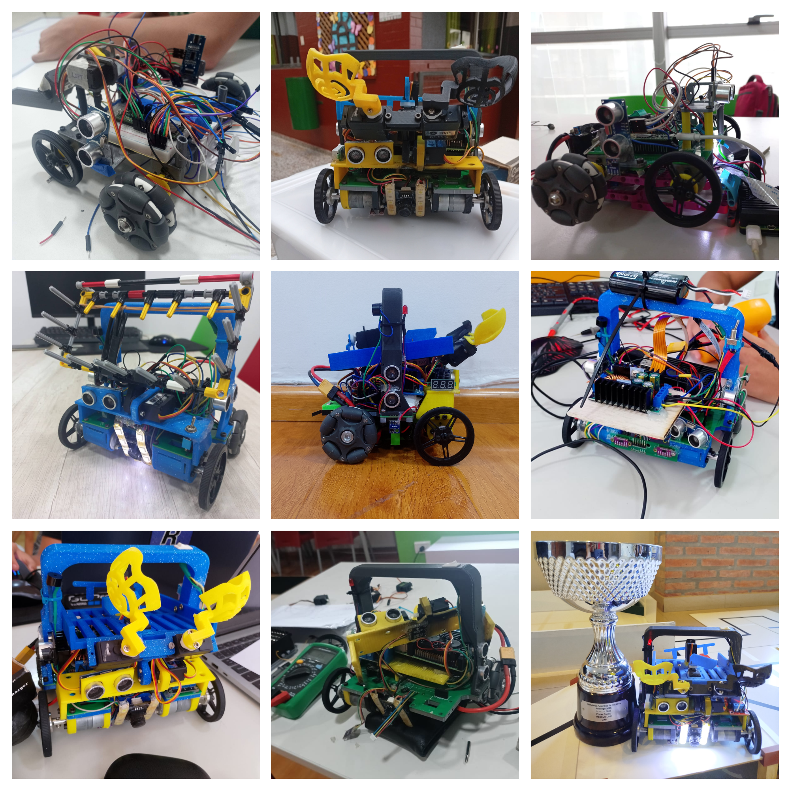

The team's history is an important part of the design. The robot evolved from a simple first-year platform into a compact 2025 competition robot with a custom rescue mechanism and integrated electronics. One week before a national competition, a major hardware failure forced the team to disassemble and rebuild the robot in a very short time. That experience changed the 2026 plan: modular parts, clearer wiring, PCB documentation, and reliability gates became design requirements instead of optional improvements.

## 2. Project Planning

### a. Overall Project Plan

The objective for 2026 is to build a robot that can complete Rescue Line consistently instead of only solving isolated tasks. The team defined requirements from the 2026 rules, the rescue-zone constraints, past national competition experience, and the short time available before the world competition.

**Table 1: Requirements, competition basis and final design solutions**

| Requirement | Rule / challenge basis | Tools / components | Final solution |
|---|---|---|---|
| Follow black lines, curves, gaps and intersections | **Rule 3.3** (Line): 1-2 cm black line on white floor, gaps up to 20 cm, arrangement varies between rounds. **Rule 3.2** (Floor): smooth or textured, steps up to 3 mm between tiles. | Wide USB camera, Raspberry Pi 4B, OpenCV | The Raspberry Pi processes a 160x120 camera image, extracts the black line, computes a steering angle, and sends speed/angle commands to the Teensy. |
| Detect green markers and red stop lines | **Rule 3.6** (Intersections and Dead Ends): green 25×25 mm markers indicate path direction; two markers = dead end, turn around. **Rule 3.3.5**: goal tile has 25×300 mm red tape strip perpendicular to the line. | LAB/HSV masks, RPi state logic, Teensy action cases | The camera pipeline detects green markers and red lines, then encodes them as `green_state` commands for left, right, double-green, and stop behavior. |
| Avoid obstacles without losing the route | **Rule 3.5** (Speed Bumps, Debris, and Obstacles): obstacles at least 15 cm high, may be fixed to floor, robot expected to navigate around them. Debris max 3 mm height. | 3x HC-SR04 ultrasonic sensors, IMU turns | The Teensy detects close obstacles and executes controlled avoidance turns using BNO055 yaw feedback. |
| Detect rescue-zone entry | **Rule 3.9.4**: entrance to evacuation zone marked by 25×250 mm reflective silver tape strip on floor. **Rule 3.9.5**: exit marked by 25×250 mm black tape strip. | Silver mask, APDS9960 color sensing, state transition bytes | The robot transitions from line mode to rescue mode when silver/plateado is detected by vision or floor sensing. |
| Search and collect victims | **Rule 3.10** (Victims): 4-5 cm diameter spheres with off-center center of mass, max 80 g. Two living (silver, reflective, electrically conductive) and one dead (black, not conductive). **Rule 3.9.7**: evacuation points are red and green right-angled triangles 30×30 cm with 6 cm walls. | Exported AI detector, camera tracking, ToF/ultrasonic wall behavior, five-servo claw | The Raspberry Pi selects targets and the Teensy executes approach, pickup, sorting and storage routines. |
| Sort victims and deposit into correct zones | **Rule 3.9.7a-b**: dead victim (black) must go to red evacuation point; living victims (silver) must go to green evacuation point. **Rule 5.6.6**: ×1.4 multiplier per successful rescue; living victims must be evacuated before dead victim multiplier applies. | Claw sorter, deposit servo, red/green zone detection, FCL/FCR limit switches | Victims are separated mechanically and released left or right after physical wall alignment. |
| Survive lighting variation and 2026 LED-wall effects | **Rule 3.9.12** *(new 2026)*: organizers may place white LED lights mounted perpendicular to evacuation zone walls on the upper part. **Rule 3.10.5** *(new 2026)*: fake victims may be placed in the evacuation zone. **Rule 3.11** (Environmental Conditions): lighting and magnetic conditions may vary. | Anti-flash preprocessing, AGCWD normalization, APDS9960 hardware path | Software preprocessing and local floor sensing reduce dependence on a single visual threshold. |
| Remain safe under crashes or switch-off | **Rule 4.2.8**: robot must have a single physical binary switch clearly visible to the referee for starting and LoP recovery. **Rule 5.5** (Lack of Progress): robot must be restartable at last checkpoint; only the declared LoP procedure is permitted. | Physical start switch, UART stop byte, global Python recovery, firmware timeouts | The robot sends/receives stop states, stops motors on switch-off, and avoids infinite movement loops through timeout guards. |
| Be repairable during competition | **Rule 4.2.7**: robot must have a handle for pick-up during scoring run. **Rule 4.4**: robot must pass re-inspection after any modification during the tournament. Short repair windows make serviceability a non-functional requirement, not only a convenience. | Modular 3D prints, custom PCB, documented power tree, accessible battery/electronics | The structure and electronics are organized to allow rapid inspection and replacement between runs. |

The project schedule was built around progressive integration: first mechanical and electronics stability, then line-following, then rescue behavior, and finally reliability tests and documentation.

**Table 2: Development schedule and gates**

| Period | Task / gate | Owner | Issues / evidence |
|---|---|---|---|
| Aug 2023 | Robot concept & architecture decisions | Team | First analysis of the robot design. |
| Sep 2023 – Mar 2024 | PCB design & electronics architecture | Benjamin | PCB, power tree and initial electronic integration. |
| Aug 2023 – Dec 2024 | Early line-following algorithm | Lucio | First line follower and vision/control base. |
| Jan – Jul 2024 | Full 3D robot design (CAD) | Laureano | Complete chassis, structure and mechanism in CAD. |
| **Jul 2024** | **Gate: stable CAD** | — | Drivetrain stable, modules printable. |
| Jun – Dec 2024 | Base line-following code integration | Lucio + team | Line code integrated on the real robot. |
| Aug 2024 – Mar 2025 | Green-marker detection & turns | Lucio | Greens, turns and intersection logic. |
| Sep 2024 – Mar 2025 | OpenCV rescue-zone prototype | Benjamin | First classical-vision rescue-zone approach. |
| Mar – Aug 2025 | Reliable full line-following version | Lucio | Stable follower: curves, greens, red, ramps, obstacles. |
| Apr – Aug 2025 | YOLOv8n rescue-model migration | Benjamin | Move from OpenCV to AI for victims and deposit zones. |
| Aug – Sep 2025 | Complete rescue-zone behavior | Benjamin + Laureano | Detection, pickup, sorting and deposit connected to the mechanism. |
| Sep 2025 | First complete robot (ONNX model) | Team | First full line + rescue version using ONNX. |
| **Sep 2025** | **Gate: first full robot (ONNX)** | — | Line and rescue integrated end-to-end. |
| **Nov 2025** | **★ Qualified for RoboCup 2026** | Team | International qualification achieved. |
| Oct – Dec 2025 | RoboLiga lessons & high deposit-zone update | Benjamin + team | Adaptation to high deposit zones not present in RoboLiga. |
| Jan – Feb 2026 | Repository migration & 2026 planning | Team | 2026 repo, issues, audits and formal planning. |
| Feb 2026 | Benchmark, rules & risk audit | Team + mentor | #5, #11, #13, #14, #19, #21 |
| **Feb 2026** | **Gate: 2026 audit & plan** | — | Risks and rule changes logged. |
| Feb – Apr 2026 | Power-tree & electronics documentation | Benjamin | #7, #40, PR #43 |
| Feb – May 2026 | Motion safety & encoder reliability | Laureano + Benjamin | #23, #27, #60, #112 |
| Mar – Apr 2026 | TFLite deployment & AI speed optimization | Benjamin | #24, #49, #124, PR #50 |
| Mar – May 2026 | Anti-flash, AGCWD & dataset retraining | Benjamin | #51, T-004 |
| May 2026 | Serial protocol & runtime hardening | Benjamin + Laureano | #74, #75, #76, #108, PR #129 |
| May 2026 | APDS floor confirmation (red/silver) | Laureano + Benjamin | #120, #126, T-006 |
| May – Jun 2026 | Physical measurement & TEST_LOG campaign | Team | #93, T-001…T-008 |
| **Jun 2026** | **Gate: TEST_LOG / service logs** | — | Measured physical evidence captured. |
| May – Jun 2026 | Final TDP diagrams & documentation | Team | #41, #46, final assets |
| May – Jun 2026 | Evacuation exit-search fix (validated) | Team | #128, T-008 (full-course exit on video) |
| Jun 2026 | Final PDF, poster & competition strategy | Team | Final submission and RoboCup preparation. |
| **Jun 2026** | **Gate: final PDF** | — | Official-template submission. |

**Visual Gantt timeline for Table 2 — milestones, member assignment, review gates and the November 2025 RoboCup qualification**

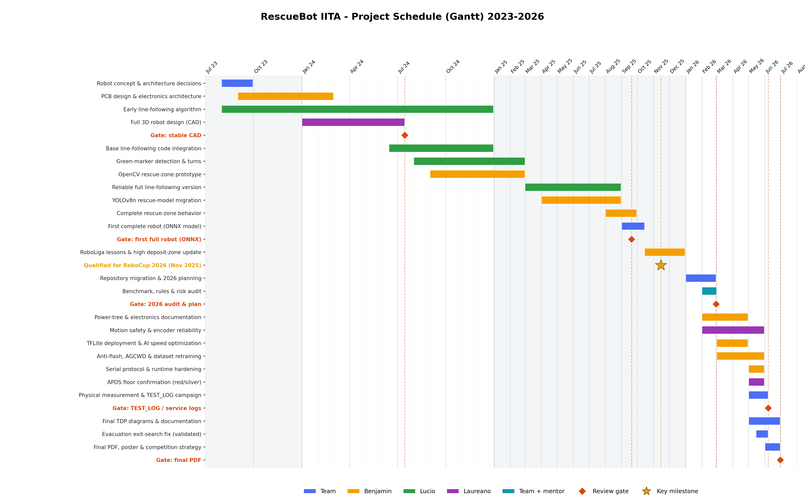

This order was chosen because each layer depends on the previous one. The team cannot tune rescue behavior without a stable drivetrain and reliable serial protocol, and it cannot claim performance reliability without a test log that records failures and fixes.

### b. Integration Plan

The robot is integrated as a distributed control system. The Raspberry Pi makes perception and high-level decisions; the Teensy executes time-critical motion and safety tasks.

**Figure 2: Simplified processor, sensor and actuator integration overview**

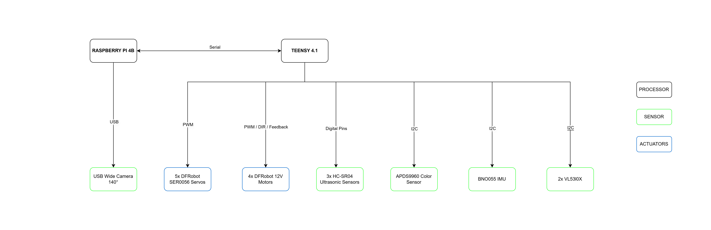

Figure 2 gives the presentation-level view of the system: the Raspberry Pi 4B handles camera input and high-level perception, the Teensy 4.1 handles deterministic sensor and actuator control, and both processors synchronize through the serial link. The color grouping separates processors, sensors and actuators so the architecture is understandable before the detailed interface map.

**Interface map for Figure 2**

| Interface | Direction | Protocol / rate | Payload / signal | Requirement supported |
|---|---|---|---|---|
| Camera to Raspberry Pi | Camera -> RPi | USB video stream | 160x120 line frames and 256x256 AI crops | Line tracking, markers, rescue perception. |
| Raspberry Pi to Teensy | RPi -> Teensy | UART, 115200 baud, 50 ms timeout | 8-byte frame: speed, angle, `green_state`, silver flag | Deterministic integration between perception and motion. |
| Teensy to Raspberry Pi | Teensy -> RPi | UART status byte | `0xF9` ready, `0xF1` rescue, `0xF8` rescue done, `0xF7` evacuation, `0xFF` stop | Safe state transitions and recovery. |
| Teensy to drivebase | Teensy -> motors, encoders -> Teensy | PWM, direction pins, encoder interrupts | Motor effort, direction and encoder feedback | Line following, obstacle bypass, calibrated distance moves. |
| Teensy to rescue module | Teensy -> servos | Servo PWM | Claw, lift, sort, right deposit, left deposit | Pickup, sorting and deposit. |
| Teensy to navigation sensors | Bidirectional | I2C and trigger/echo | BNO055 yaw, VL53L0X distance, HC-SR04 distance | Turns, wall approach, obstacle detection. |
| Teensy to floor/safety modules | Bidirectional / digital input | I2C and digital I/O | APDS9960 floor readings, switch, FCL/FCR, LEDs, buzzer | Silver/floor confirmation, physical alignment and stop behavior. |

**Table 3: Component-to-requirement integration**

| Component | Communication / interface | Requirements satisfied |
|---|---|---|
| Raspberry Pi 4B | USB camera, UART to Teensy | Line tracking, marker decisions, rescue target selection, state management. |
| Teensy 4.1 | UART from RPi, PWM, I2C, digital I/O, interrupts | Real-time motors, sensors, claw, stop behavior and movement sequences. |
| Custom PCB | Power and signal routing | Serviceability, compact wiring, stable integration of sensors and actuators. |
| Camera | USB video stream | Black line, green markers, red line, silver detection, rescue objects and zones. |
| Distance sensors | HC-SR04 and VL53L0X read by Teensy | Obstacle detection, wall following and rescue-zone alignment. |
| BNO055 IMU | I2C | Controlled turns, yaw reset, ramp/pitch-based speed adaptation. |
| Five-servo claw | PWM from Teensy | Pick, lift, sort, store and deposit victims. |

The RPi-to-Teensy frame is intentionally small:

```text
[0xFF, speed, 0xFE, angle, 0xFD, green_state, 0xFC, silver_line]
```

Teensy sends state bytes back to the Raspberry Pi, including ready (`0xF9`), rescue (`0xF1`), rescue done (`0xF8`), evacuation (`0xF7`) and stop (`0xFF`). This keeps the robot synchronized without a complex network stack.

## 3. Hardware

The hardware is fully custom and organized around three goals: stability on the course, serviceability between runs, and clear separation between sensing, computation, power and actuation.

**Figure 3: Hardware overview**


The hardware overview separates power, sensor signals, control signals and serial communication. It shows the 11.1 V 3S battery feeding the 12 V motors directly, an XL4016 regulator supplying the 5 V compute/control rail, and an MP1584 regulator supplying the 6 V servo rail. This diagram is used by the team to explain the robot quickly before moving into CAD and PCB-level details.

**Figure 4: CAD-to-built comparison of the final robot assembly**

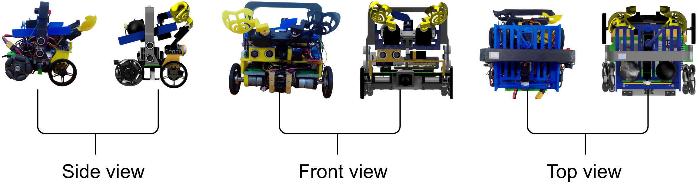

### a. Mechanical Design and Manufacturing

The structure was designed in Fusion 360 and manufactured as multiple 3D-printed modules. Figure 4 compares the side, front and top CAD views against the physical robot, showing that the printed chassis, camera support, rescue mechanism, electronics tray and storage module were carried from design into the final assembly. The CAD package includes editable files, STL exports and orthogonal robot views. The current CAD documentation lists the assembly parts and screw count, which makes the robot easier to rebuild after transport or competition damage.

The final CAD envelope of the robot is 157.189 mm long, 176.913 mm wide and 176.239 mm high. These dimensions keep the robot compact enough for Rescue Line navigation while leaving vertical space for the camera mount, electronics layer and rescue mechanism.

The lower level contains the drivetrain: four 12 V DC motors with encoders, fixed wheels and omniwheels. The design keeps the battery and motors low to reduce the center of gravity, which is important for ramps, seesaws and abrupt turns. The middle level supports electronics and wiring. The front/upper area holds the camera and rescue mechanism, while the rear/upper path handles storage and deposit.

The rescue mechanism is the most important mechanical subsystem. It uses five servos: two grippers, one lift servo, one sorting servo and one deposit servo. Separating these functions makes calibration easier because gripping, lifting, sorting and releasing can be tuned independently. The mechanism stores victims in an inclined path and uses a deposit servo to release them toward the selected side.

**Figure 4b: Claw mechanism — exploded view with servo labels (Fusion 360 render)**

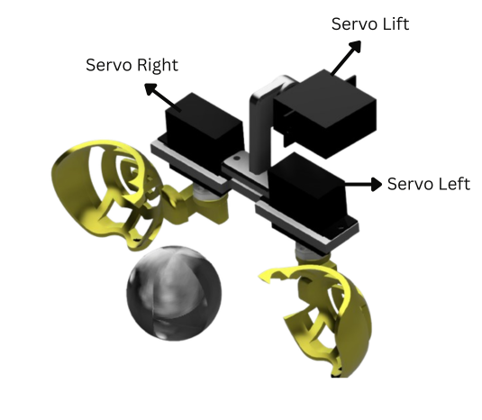

Figure 4b shows the claw mechanism in an exploded Fusion 360 render with each servo labeled. Servo Left and Servo Right drive the two custom-printed gripper fingers (yellow), which close around the victim ball. Servo Lift raises the closed gripper to lift the captured victim off the floor. The three-servo front assembly (Left, Right, Lift) is mounted on a shared 3D-printed PLA rail, so the grip width and lift height can be adjusted independently. The custom finger geometry was designed to hold both spherical victims (black and silver) without requiring a separate grip configuration for each type.

**Figure 4c: Rescue mechanism assembly — Servo Sort and Servo Deposit in chassis context (Fusion 360 render)**

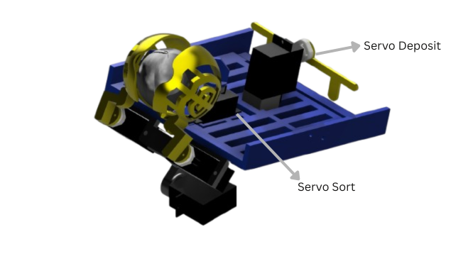

Figure 4c shows the full rescue mechanism mounted on the robot chassis (blue). Servo Sort directs the victim into the correct internal storage channel after lift (black victims go to the left channel, silver victims to the right). Servo Deposit is mounted at the rear of the storage path and releases victims toward the selected deposit zone side when the robot is aligned against the evacuation wall using the FCL/FCR limit switches. This two-stage sorting and deposit design keeps the internal storage path compact and avoids the need for a separate conveyor or additional actuator layer.

**Table 4: Mechanical submodules**

| Submodule | Function | Design reason |
|---|---|---|
| Drivebase | Four driven encoder motors with differential steering | Provides traction and controlled movement while preserving simple kinematics. |
| Camera mount | Keeps the wide camera fixed relative to the chassis | Makes visual calibration repeatable. |
| Five-servo claw | Grabs, lifts, sorts and releases victims | Allows victim handling without a large conveyor or complex mechanism. |
| Storage/deposit path | Separates collected victims and releases left/right | Supports scoring strategy while keeping the robot compact. |
| Sensor mounts | Hold ToF, ultrasonic and color sensors in fixed positions | Reduces calibration drift and protects sensors during runs. |
| Electronics layer | Holds Raspberry Pi, Teensy, PCB and wiring | Improves service access and separates electronics from the claw path. |

**Figure 4d: Mechanical submodule interaction map — mounting interfaces and victim pathway**

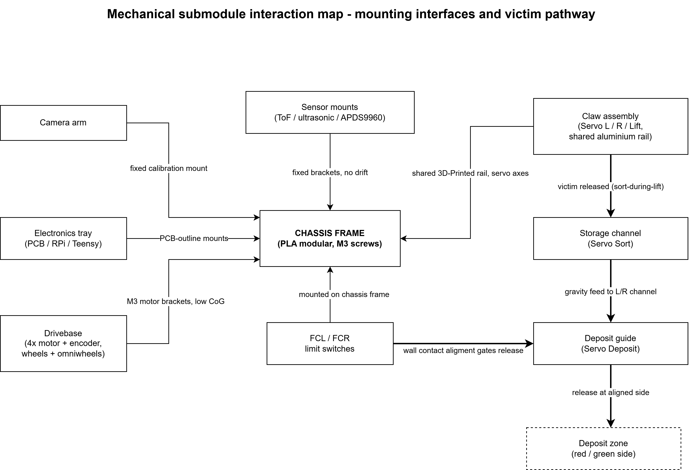

Figure 4d makes the internal mechanical interfaces explicit. The PLA chassis frame is the structural backbone: the drivebase, electronics tray, camera arm and sensor mounts each attach through a dedicated interface (M3 motor brackets, PCB-outline mounts, a fixed calibration mount and fixed sensor brackets), which keeps the centre of mass low and the camera/sensor calibration stable across reprints. The orange path traces a victim through the rescue mechanism: the claw (three servos on a shared 3D-printed rail) releases the ball during the sort-during-lift step, the storage channel (Servo Sort) routes it by gravity to the left or right channel, and the deposit guide (Servo Deposit) releases it at the side selected once the FCL/FCR limit switches confirm wall-contact alignment.

Reliability testing for the mechanical system is organized around the failures that lose the most points: line drive repeatability, ramp stability, pickup success, storage retention and deposit alignment. The drivetrain distance scale was first calculated from the kinematic model: a 60 mm wheel and 540 ticks/rev give `pi x 60 / 540 = 0.3491 mm/tick`, equivalent to 28.65 ticks/cm. On the physical robot, repeated movement calibration led the team to use 25 counts/cm in `runDistance()`. This calibrated value compensates for the real drivetrain behavior instead of relying only on the ideal geometry. The team uses actuator tests in `software/teensy/firmware/test/actuators/` and records final physical results in `testing/TEST_LOG.md`.

**Table 5: Mechanical reliability tests — quantitative criteria, results and verdicts**

| Test | Method | Quantitative criterion | Measured result | Sample | Verdict | Source |
|---|---|---|---|---|---|---|
| Straight distance (short) | `runDistance()` at 25 counts/cm calibration | error ≤ ~1 cm | ≈ 1 cm | repeated | PASS | T-001 |
| Straight distance (longer) | `runDistance()` longer moves | error ≤ ~2 cm | ≈ 1–2 cm | repeated | PASS | T-001 |
| Turn accuracy | `runAngle()` 45 / 90 / 180° | stop within ±1° (IMU tolerance) | stops at ≈ 1° | repeated | PASS | T-001 |
| Victim pickup | black/silver from varied approach offsets | ≥ 80 % captured, lifted, no drop | 8/10 | n = 10 | PASS | T-005 |
| Deposit (FCL/FCR) | wall-align, release left/right | ≥ 90 % correct release | 10/10 | n = 10 | PASS | T-005 |
| Full-course pickup | collect all victims in one pass | 3 victims, no reset | 3/3 in one pass | 1 run | PASS | T-003 |
| Ramp-up stability | drive up incline | no false-silver, no line loss | 8/10 (after APDS9960 + LED fix) | n = 10 | PASS | T-006 |
| Seesaw / abrupt drop | traverse seesaw | recover after impact | 9/10 | n = 10 | PASS | T-006 |
| Lateral ramp | lateral incline traverse | hold trajectory, no tip-over | 0/10 | n = 10 | **FAIL** | T-006 |
| Clutter / toothpicks | debris on line and in rescue zone | keep functioning | works (unless > 80 % of marker covered) | qualitative | PASS | T-006 |

The first physical measurement session recorded in `testing/TEST_LOG.md` confirms that `runDistance()` is repeatable enough for the current TDP evidence: short distances showed approximately 1 cm error, while longer distances showed approximately 1-2 cm error. `runAngle()` also stopped within the observed 1 degree target tolerance.

The innovative mechanical solution is the compact five-servo rescue module. It gives the team a competitive advantage because the robot can collect, sort and deposit victims with a mechanism that remains printable, repairable and lightweight.

The rescue mechanism reached its current form through deliberate design iteration. In 2024, the team used a cage-style mechanism suited to the national competition format, which had a single shared deposit zone with no elevated colored areas. When the 2026 rules introduced elevated colored deposit zones requiring victim sorting, the team redesigned around a modular five-servo concept. Across all iterations, the internal storage box containing the sort and deposit paths remained architecturally constant — only the gripper finger geometry evolved to improve grip reliability on both victim types.

Three design decisions make the final mechanism specifically innovative for Rescue Line 2026:

**1. Universal grip geometry.** The custom-printed finger shape (Figures 4b and 4c) grips both black and silver spherical victims with identical servo angles (`open()`: left 120°/right 180°, `close()`: left 200°/right 80°). No grip reconfiguration is needed between victim types — only the vision-driven approach direction and sort command differ. A single-servo pincer cannot reliably grip spheres of variable approach angle; a magnetic pickup only works with metallic victims.

**2. Concurrent sort-during-lift.** The pickup sequence in `claw.cpp` executes `sortLeft()` (170°) or `sortRight()` (90°) simultaneously with `lift()` in `CL_PICKUP_LEFT_STEP2` / `CL_PICKUP_RIGHT_STEP2`. While the lift servo raises the closed gripper, the sort servo simultaneously rotates the storage channel entrance to the target side. When `open()` fires in step 3, the victim is already aligned and falls directly into the correct channel under gravity. This removes a dedicated sequential sort step, shortening the pickup cycle time without adding hardware.

**3. Fully decoupled functions.** Grip angle, lift height, sort direction, and deposit side are each controlled by a single dedicated servo. Calibrating grip force does not affect lift clearance; changing deposit timing does not affect sort angle. This decoupling was a direct lesson from the 2024 cage design, where grip and sort were mechanically coupled and could not be tuned independently. The five-servo modular approach gives the team a practical competitive advantage: any single function can be re-calibrated or the servo replaced in under 10 minutes without affecting the rest of the rescue sequence.

The entire robot structure is an original team design: chassis frame, motor mounts, wheel hubs, omnidirectional corner supports, camera arm, electronics tray, claw housing, victim storage channel and deposit guide were all modeled in Fusion 360 and manufactured by the team. No third-party chassis kit or frame was used. This means every module fits the robot's exact geometry, spare parts can be reprinted from the same files, and competition-day repairs do not require re-calibration of the sensor or claw positions.

**Table 4b: 3D printing and manufacturing parameters**

| Parameter | Value | Purpose |
|---|---|---|
| Material | PLA | Lightweight, easy to reprint between rounds, sufficient stiffness for the competition loads at this robot scale. |
| Infill | 30 % structural / 20 % covers | Structural parts (motor mounts, claw housing, chassis rails) use 30 % for impact resistance; protective covers and lightweight enclosures use 20 % to reduce mass. |
| Layer height | 0.20 mm | Standard quality layer height: dimensional tolerance for encoder shaft holes and sensor mount features is within ±0.1 mm. |
| Perimeter / wall count | 3 | Three perimeter shells on impact-critical zones (claw frame, front bumper, drivebase side rails) resist cracking under ramp and seesaw shock. |
| Nozzle diameter | 0.4 mm | Standard nozzle allows the fine features required for limit-switch posts, sensor brackets and wire-routing channels. |
| Print orientation | Flat base down for all structural plates | Maximizes layer-bonding direction against the main mechanical load: ramp contact forces push laterally across layers rather than through them, reducing delamination risk. |
| Repair strategy | All modules use standard M3 screws. A damaged claw housing, camera arm or motor mount can be replaced from reprinted spare stock in under 10 minutes without dismantling the rest of the robot. This was made a design requirement after the 2025 national competition rebuild episode. | — |

### b. Electronic Design and Manufacturing

The electronic architecture is centered on a Raspberry Pi 4B and a Teensy 4.1. The Raspberry Pi handles high-level processing and camera work; the Teensy handles real-time sensor and actuator control. The system also includes a custom PCB, a 3S LiPo battery, regulated power rails, an XT60 connector, motor drivers, five servos, three HC-SR04 ultrasonic sensors, two VL53L0X ToF sensors, one BNO055 IMU, one APDS9960 color/proximity sensor, a buzzer, LEDs, a relay output and physical switches.

**Figure 5: Custom PCB layout and schematic**

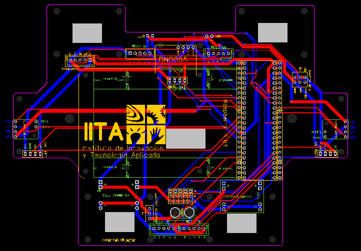

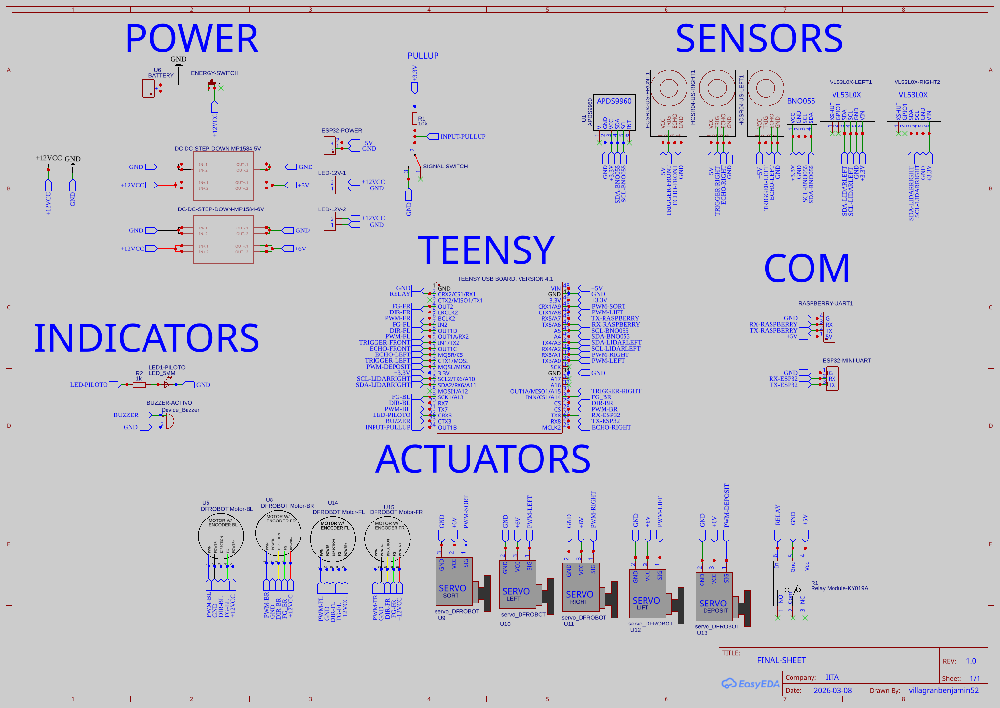
The custom PCB and schematic make the electronic interfaces explicit: power input, regulated rails, Teensy pinout, Raspberry Pi UART, motor outputs, servo outputs, APDS9960, BNO055, ultrasonic sensors, VL53L0X sensors, indicators, relay and switches. This is stronger than only listing parts because the judge can see how the system is actually integrated.

The PCB evidence is stored in `hardware/electronics/PCB_Main/`, including the schematic PDF, PCB preview and board source file. The power-tree document describes the intended separation between motor, logic, Raspberry Pi and servo rails. This separation is important because camera processing and motor/servo current spikes happen at the same time during rescue. The servo rail is isolated from the compute rail: the five DFRobot SER0056 servos are powered by an MP1584 buck regulator measured at 6.1 V, while the Raspberry Pi and Teensy are powered from a separate XL4016 rail measured at 5.0 V. This prevents rescue-mechanism current spikes from directly loading the Raspberry Pi supply.

The drivetrain uses four 12 V DFRobot motors rated at 159 RPM with integrated encoder feedback. The field-calibrated encoder scale is 25 counts/cm, derived from the theoretical kinematic model of 28.65 ticks/cm (`pi x 60 mm / 540 ticks/rev`) and corrected on the physical robot. The IMU-based turn routine stops when yaw error is within +/-1.0 degree. The five DFRobot SER0056 clutch servos use a 540-2390 us pulse range over 274 degrees in the firmware, and the component specification includes a clutch mechanism plus electronic shutoff after 5 s of blockage. At the measured 6.1 V servo rail, the mechanism is designed for normal sequenced motion on the MP1584: the firmware does not command all five servos to move together during the rescue/deposit routine. The highest normal command groups are the two claw fingers during open/close and selected two-servo combinations such as sort/lift; therefore five-servo stall is documented only as a conservative electrical upper bound, not as the expected operating case.

**Table 6: Electronic submodules**

| Submodule | Components | Function |
|---|---|---|
| Main compute | Raspberry Pi 4B | Vision, AI inference path, high-level robot states and serial output. |
| Low-level controller | Teensy 4.1 | Motors, sensors, servos, parser, safety and deterministic routines. |
| Vision | Wide USB camera | Main perception source for line, markers, rescue objects and zones. |
| Navigation sensors | BNO055, VL53L0X, HC-SR04 | Yaw turns, ramp behavior, obstacle detection and wall behavior. |
| Floor and exit sensing | APDS9960 and controlled light path | Confirms floor colors and supports black/silver exit behavior. |
| Power subsystem | 3S LiPo, regulators, PCB, XT60 | Supplies separated loads and simplifies wiring. |

**Table 6b: Teensy pinout and sensor placement map**

| Subsystem | Teensy pin / bus | Direction | Physical placement / use | Source |
|---|---|---|---|---|
| Raspberry Pi UART | `Serial5` | Bidirectional | RPi command/status link for speed, steering, rescue and evacuation states. | `main.cpp` |
| Back-left motor | PWM 29, DIR 28, ENC 27 | Output + interrupt input | Left drivetrain side. | `main.cpp` |
| Front-left motor | PWM 7, DIR 6, ENC 5 | Output + interrupt input | Left drivetrain side. | `main.cpp` |
| Back-right motor | PWM 36, DIR 37, ENC 38 | Output + interrupt input | Right drivetrain side. | `main.cpp` |
| Front-right motor | PWM 4, DIR 3, ENC 2 | Output + interrupt input | Right drivetrain side. | `main.cpp` |
| Sort servo | 23 | PWM output | Rescue storage/sorting module. | `main.cpp`, `claw.cpp` |
| Left claw servo | 14 | PWM output | Left gripper finger. | `main.cpp`, `claw.cpp` |
| Right claw servo | 15 | PWM output | Right gripper finger. | `main.cpp`, `claw.cpp` |
| Lift servo | 22 | PWM output | Claw lift axis. | `main.cpp`, `claw.cpp` |
| Deposit servo | 12 | PWM output | Left/right victim release. | `main.cpp`, `claw.cpp` |
| HC-SR04 sonar 0 | TRIG 8, ECHO 9 | Output + input | Obstacle / wall distance array. | `main.cpp` |
| HC-SR04 sonar 1 | TRIG 11, ECHO 10 | Output + input | Obstacle / wall distance array. | `main.cpp` |
| HC-SR04 sonar 2 | TRIG 39, ECHO 33 | Output + input | Obstacle / wall distance array. | `main.cpp` |
| BNO055 IMU | I2C, address `0x28` | Bidirectional | PCB-mounted orientation sensor for yaw turns and ramp behavior. | `main.cpp` |
| APDS9960 color sensor | I2C | Bidirectional | Floor-facing color/proximity sensor with controlled LED path. | `main.cpp` |
| VL53L0X left/right ToF | I2C | Bidirectional | Left/right wall and rescue-zone distance sensing. | `main.cpp` |
| FCL / FCR limit switches | 40 / 41 | Digital input | Physical left/right deposit alignment. | `main.cpp` |
| Main switch | 32 | Digital input | Competition stop / lack-of-progress handling. | `main.cpp` |
| Relay output | 0 | Digital output | External power/lighting control. | `main.cpp` |
| Buzzer and red LED | 31 / 30 | Digital output | Audible and visible debug/safety feedback. | `main.cpp` |

Electronic quality assurance is based on bench validation before full robot runs: rail voltage checks under servo load, sensor boot checks, serial frame tests, switch-off tests and connector inspection. The final QA mini-log for the TDP evidence records: critical boot path OK, Raspberry Pi <-> Teensy UART OK, connector/PCB service inspection OK, servo rail OK at 6.1 V, logic/compute rail OK at 5.0 V, and stop/switch behavior OK during the final integrated tests. The official 2026 BOM export uses the current hardware source in the repository; at the time of this draft, the PCB BOM lists a 3S 11.1 V 2200 mAh LiPo.

The initial battery measurement session started at 12.6 V. After 5 minutes powered on at rest, the pack measured 12.5 V. In continuous operation, the robot ran for approximately 1 hour until reaching 10.5 V. A high-stress check with the full program, motors at `speed = 60` and continuous pickup movement was also run for 10 minutes; the pack dropped by 1.4 V during that stress case, which corresponds to approximately 11.2 V if referenced to the 12.6 V start of the session.

**Table 6c: Electronic reliability tests — power, rails and integration**

| Test | Method | Criterion | Measured result | Verdict | Source |
|---|---|---|---|---|---|
| Battery start voltage | 3S pack at full charge | ~12.6 V | 12.6 V | PASS | T-001 |
| Idle drop (5 min) | powered at rest | no significant drop | 12.6 → 12.5 V | PASS | T-001 |
| Continuous autonomy | run until 10.5 V cutoff | sustain a long session | 1 h to 10.5 V | PASS | T-001 |
| High-stress voltage drop | full program, motors `speed=60`, continuous pickup, 10 min | no reset/failure under load | 1.4 V drop, no reset | PASS | T-001 |
| Servo rail under load | measure MP1584 output | dedicated ~6 V rail | 6.1 V | PASS | T-007 |
| Compute/control rail | measure XL4016 output | separate ~5 V rail | 5.0 V | PASS | T-007 |
| Rail isolation | servo MP1584 vs compute XL4016 | independent supplies, no cross-reset | confirmed separate | PASS | T-007 |
| Servo current envelope | firmware command audit | ≤ 2 mechanism servos in normal sequence | 1–2 servos; no 5-servo phase | PASS | T-007 |
| RPi ↔ Teensy UART | telemetry during service run | frame counter keeps rising | `frames_sent` 1 → 2204 | PASS | T-002 |
| Critical boot path | power-on init of all sensors | boot OK or visible failure | boot path OK | PASS | bench |
| Stop / switch-off | toggle main switch mid-run | motors stop immediately | stop behavior OK | PASS | bench |

The main electronic innovation is the custom PCB-centered architecture — a co-designed electromechanical system where the board shape, component placement and mounting holes directly define the robot's mechanical structure and center of mass. Instead of a loose breadboard-style wiring layout fitted inside a pre-existing chassis, the team designed the PCB first and then built the 3D-printed chassis around it.

**PCB shape and structural co-design.** The PCB footprint matches the robot's chassis base dimensions. Every component position — Teensy 4.1, power regulators, sensor connectors, motor outputs, servo headers and APDS9960 — was placed strategically so that each wire reaches its destination at minimum length and without routing conflicts. The mounting holes on the PCB were co-designed with the 3D chassis: Laureano modeled the printed structure directly from the board outline and hole positions, which allowed the chassis to hold the PCB at a fixed height and orientation that keeps the robot's center of mass stable over the drivetrain. This approach means that any future chassis reprint will automatically align with the existing PCB without re-routing cables or repositioning components.

**Power architecture iteration driven by measured failure.** In 2024, the PCB used two MP1584 buck regulators: one adjusted to 6 V for the five servo loads, and one adjusted to 5 V for the Raspberry Pi and Teensy. During testing, the team observed repeated Raspberry Pi resets and boot failures that correlated with vision-heavy load cycles. Root cause analysis identified the MP1584 rated at 3 A continuous as undersized for the Raspberry Pi 4B, which can draw close to that limit during concurrent TFLite inference, camera capture and UART communication. In 2025, the team replaced the compute-rail MP1584 with an XL4016 rated at 8 A continuous. Since that change, no RPi reset under vision or combined motor-plus-servo load has been observed through all subsequent test sessions.

This iteration demonstrates the design principle behind the separated rail architecture: the servo rail (MP1584 at 6.1 V) carries fast current spikes from claw motion; the compute rail (XL4016 at 5.0 V) carries the sustained load of the Raspberry Pi under AI inference. If both loads shared one regulator, either rail margin would be insufficient, or a single high-spec regulator would create a single point of failure for the whole robot. The current dual-regulator design ensures that a servo fault cannot reset the vision processor and a compute overload cannot collapse the actuator supply.

## 4. Software

### a. General Software Architecture

The software is split by timing requirements. The Raspberry Pi runs Python with OpenCV, NumPy, serial communication, camera threads and the exported detector path. The Teensy runs Arduino/C++ firmware with motor, sensor, serial and claw control.

**Figure 6: Main process — overall software architecture**

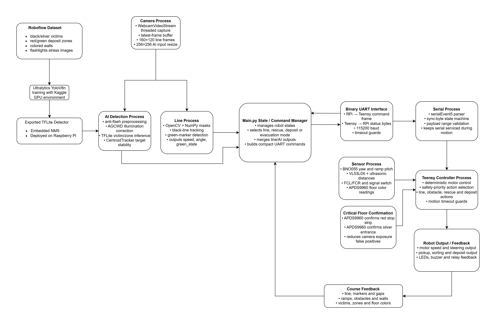

Figure 6 shows the complete data flow and process ownership across the whole system. On the left, the Roboflow dataset feeds YOLOv8n training, whose exported TFLite model is deployed to the Raspberry Pi. The Camera Process runs a WebcamVideoStream with a latest-frame buffer, producing 160×120 frames for the Line Process (OpenCV + NumPy masks, black-line tracking, green-marker detection) and 256×256 crops for the AI Detection Process (anti-flash preprocessing, AGCWD illumination correction, TFLite victim/zone inference, CentroidTracker target stability). Both processes feed the `Main.py` State/Command Manager, which selects line, rescue, deposit or evacuation mode and builds compact UART commands. The Binary UART Interface (115200 baud, timeout guards) connects to the Teensy's Serial Process (sync-byte state machine, payload range validation) and then to the Teensy Controller Process (deterministic motor control, safety-priority action selection, motion timeout guards). The Sensor Process provides BNO055 yaw/pitch, VL53L0X/ultrasonic distances, FCL/FCR limit switches and APDS9960 floor color. The Critical Floor Confirmation block uses APDS9960 to confirm red stop strips and silver entrance, reducing camera-only false positives. Course feedback (line, markers, ramps, obstacles, victims, zones, floor colors) closes the loop back to the Camera Process.

**Figure 7: Startup and synchronization flow**

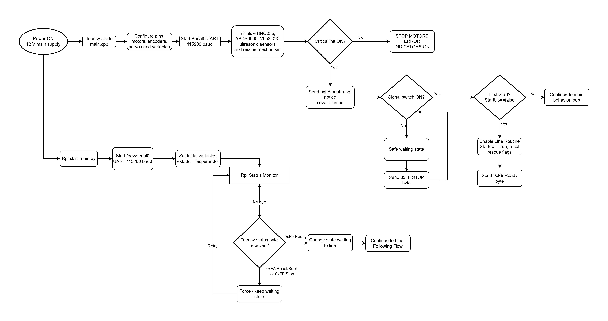

Figure 7 shows the dual-boot handshake between the Raspberry Pi and Teensy. On the Teensy side: power-on triggers `main.cpp`, configures all pins, motors, encoders and servos, starts Serial5 at 115200 baud, initializes BNO055, APDS9960, VL53L0X, ultrasonic sensors and the rescue mechanism, then checks critical init. If any critical sensor fails, motors stop and error indicators turn on. On success, the Teensy sends `0xFA` boot/reset bytes repeatedly and waits for the signal switch. When the switch is ON for the first time (`StartUp == true`), it enables the line routine, resets rescue flags and sends `0xF9 Ready`. On the Raspberry Pi side: `main.py` opens `/dev/serial0` at 115200 baud, sets `estado = 'esperando'` and enters the RPi Status Monitor loop. It waits for a Teensy status byte: `0xF9 Ready` transitions to line-following mode; `0xFA Reset/Boot` or `0xFF Stop` keeps the robot in the safe waiting state. This handshake ensures the Teensy firmware and Python program are synchronized before any movement begins.

**Figure 8: Line following — Teensy decision flow and RPi vision pipeline**


Figure 8 shows both sides of line mode in parallel. On the left, the Raspberry Pi Vision Pipeline runs a WebcamVideoStream at 160×120, applies OpenCV masks for black-line steering angle, green-marker detection and red/silver visual redundancy, then builds a UART command (speed, angle, green_state). On the right, the Teensy reads the UART command frame and all local sensors (APDS9960 color, ToF + ultrasonic distances, BNO055 pitch/yaw) every loop iteration, then cascades through a priority decision tree: Signal Switch OFF → stop motors and wait; Silver entrance confirmed (APDS = Plateado or silver_line byte) → notify rescue mode and exit line loop; APDS red stop strip → stop motors 10 s then continue; Obstacle detected (front ultrasonic < 12 cm) → obstacle bypass with curve-until-black-line recovery; Single green marker command → turn left or right according to `green_state`; Two green marker command → rotate 180° using BNO055; Ramp/seesaw detected by pitch axis → adjust baseline speed. If none of the above apply, the Teensy executes normal line steering from the RPi angle command.

**Figure 9: Rescue zone — victim search, deposit and exit flow**


Figure 9 shows the four-stage rescue zone sequence. **Stage 1 — Initialization:** loads the TFLite model, initializes the detector, sets status to "searching for victims" and retrieves variables from the vision threads. **Stage 2 — Victim search and pickup:** the robot rotates or searches to one side, captures a frame and runs victim detection inference; if a valid bounding box is selected by CentroidTracker, the robot drives toward the target; when close enough, it picks up the victim and places it in the correct storage side (black → left storage, silver → right storage); `ball_counter` increments; when 3 victims are collected, the Teensy sends `0xFB` and the state transitions to deposit phase. **Stage 3 — Deposit zone detection and deposit flow:** the robot runs AI deposit-zone detection and selects a valid target via CentroidTracker with a state filter; green zone is targeted first (`green_state = 9`): rotate/search, drive toward, deposit with Teensy servo routine, mark green deposit done (`veces_deposit++`), then set objective to "Find Red Zone"; red zone is targeted second (`green_state = 8`): same approach sequence, deposit, and when `veces_deposit == 2` the Teensy sends `0xF7` and the objective is set to "Exit". **Stage 4 — Exit routine:** the robot reads APDS9960 and ultrasonic sensors; if a black exit line is detected (APDS = Negro) the robot confirms exit and returns to line mode (sends `0xF9`); if silver is detected (APDS = Plateado) the robot reverses and turns 90°; otherwise it drives forward monitoring the right wall, checks for a wall opening, checks for a front wall and checks for an AI zone marker, then continues exit search.

Line following is done with classical vision because it is fast and predictable. The robot rotates and resizes the frame, computes masks for black, green, red and silver, estimates a steering angle from the black line, and sends a compact UART frame to the Teensy. Green and red detections are encoded as state commands, while silver detection starts rescue behavior.

The confirmed production parameters are extracted from the codebase. The vision pipeline captures frames at 160 x 120 px using a 140 degree wide-angle USB camera. The AI detector uses a 256 x 256 px input every 3 camera frames, with confidence thresholds of 45% for `negro`, 45% for `plateado`, 50% for `rojo alto`, and 60% for `verde_alto`. The Raspberry Pi to Teensy UART link runs at 115200 baud with an 8-byte frame and a 50 ms serial timeout.

Rescue mode uses a 256x256 exported detector path and tracking logic. The current production branch initializes a TFLite interpreter globally and warms it up before rescue mode, while ONNX/NCNN artifacts remain in the repository as model export history. The deployed model file and runtime are recorded with the final Raspberry Pi image so that code, documentation and competition setup stay synchronized.

The Teensy firmware parses the serial frame, validates ranges, updates speed/steer/task variables, and executes movement routines. Encoders support distance movement, the BNO055 supports yaw turns, and the APDS9960 supports floor color classification. The firmware also includes timeout guards and visible failure behavior so that a sensor problem does not silently trap the robot in a movement loop.

**Table 7: Software modules and tools**

| Module | Tools / files | Function |
|---|---|---|
| Camera capture | `camthreader.py` | Keeps the latest camera frame available without blocking processing. |
| Line vision | `Main.py` with OpenCV/NumPy | Black line, green markers, red line and silver detection. |
| Rescue detector | TFLite/YOLO-family exported model path | Victim and zone target selection. |
| UART protocol | `Main.py`, `serialEvent5()` | RPi-to-Teensy synchronization. |
| Motion control | `drivebase` library | Motor PWM, direction and encoder pulse use. |
| Rescue mechanism | `claw` library and firmware routines | Pickup, sorting, storage and deposit actions. |
| Safety/recovery | global Python loop, switch handling, firmware timeouts | Stop, restart and degraded behavior. |

### b. Innovative Solutions

#### Innovation 1: Hybrid classical + AI perception

Classical image processing handles line following at full camera speed because it is deterministic and fast to debug. AI detection is reserved for the rescue zone, where color masks and circle detection fail under variable lighting. This separation means the robot never pays the cost of AI inference during line following.

The AI dataset was also updated because the 2026 evacuation-zone walls may use colors outside the neutral walls used in earlier practice fields. The 2026 rules allow evacuation-zone walls of any color except the semantic colors red, green and black, and committee discussion explicitly notes that bright orange walls are within the expected adaptation range. The team observed a concrete failure case: with a fluorescent orange wall, the detector could confuse the wall with the red deposit zone, which affected black-victim deposit behavior. This was classified as a dataset distribution problem rather than a code bug.

The current Roboflow dataset snapshot contains 6256 images, 9521 annotations, 711 null examples, and 0 missing annotations across four deployed classes: `plateado` 3029, `negro` 2488, `verde_alto` 2147, and `rojo_alto` 1857. White, light-brown, orange, yellow and gray wall conditions are now recorded and annotated; the final deployed TFLite branch also includes the flashlight-stress and colored-background cases used in the physical rescue-zone tests.

The training configuration was chosen for the same robustness goal. The team trained from `yolov8n.pt` for 100 epochs at 256 x 256 px with AMP enabled. Color augmentation was deliberately aggressive for saturation and brightness (`hsv_s=0.7`, `hsv_v=0.8`) to simulate washed-out colors, strong LED reflections and backlight, while hue shift stayed low (`hsv_h=0.015`) so red and green semantic classes would not be randomly swapped. Geometric augmentation used moderate rotation, translation, scale and shear, and robustness augmentation used mosaic, mixup, copy-paste and erasing. Kaggle validation of the best weights reached 0.971 precision, 0.929 recall, 0.932 mAP50 and 0.767 mAP50-95 over 224 validation images and 427 instances. Per-class validation remained strong for `negro` (mAP50 0.995), `plateado` (0.904), `rojo_alto` (0.929) and `verde_alto` (0.898). In team tests, this configuration kept black and silver victim detections separated under strong flashlight-style illumination and improved detection of the high red/green deposit zones against the recorded wall colors.

Measured evidence and figure reference: Table 9 records the 160 x 120 px line-vision path, the 256 x 256 px detector path, and the every-3-frames detector cadence. Figures 6 through 9 show startup, line mode, rescue detection, deposit and evacuation logic. Dataset evidence is stored in `docs/tdp/roboflow-dataset-status-2026-05-23.md`, including the data-collection-to-deployment feedback loop that converts on-robot failures into new training data.

#### Innovation 2: TFLite migration with embedded NMS and global warmup

The rescue detector was originally deployed using the ultralytics ONNX runtime. Profiling on the competition hardware (Raspberry Pi 4B 8GB) showed this was the main speed bottleneck in rescue mode.

The team migrated to a TFLite interpreter with the NMS postprocessing step embedded directly in the exported model (export flag `nms=True`), eliminating the Python-side NMS overhead. TFLite uses the XNNPack delegate with ARM NEON kernels optimized for Cortex-A72, giving a structural advantage over ONNX Runtime on this CPU.

**Measured result on Raspberry Pi 4B:**

| Configuration | FPS on Pi 4B |
|---|---:|
| ONNX + ultralytics | ~7 FPS |
| TFLite + NMS embedded | ~18 FPS |
| Improvement | +157% same model, same weights |

**Figure 10: FPS comparison - ONNX (left, 7.14 FPS) vs TFLite with AGCWD (right, 18.10 FPS)**


A global warmup was added: at program startup, a 256 x 256 black dummy image is run through the interpreter before any competition task begins. This eliminates the JIT compilation spike on the first real inference.

**Measured warmup effect (Raspberry Pi 4B):**

| Mode | First inference (PRED[0]) | Avg inference |
|---|---:|---:|
| Without warmup | 177.7 ms | 38.7 ms |
| With warmup | 67.0 ms | 50.6 ms |
| Improvement | -62% latency spike | stable |

The robot also uses `DETECT_EVERY=3` with a CentroidTracker that maintains victim position between inference frames, preserving tracking continuity without running the full detector on every frame.

Measured evidence and figure reference: Figure 10 shows the measured ONNX and TFLite FPS screenshots from the Raspberry Pi 4B.

#### Innovation 3: Anti-flash + AGCWD preprocessing for 2026 LED wall rule

RoboCup 2026 introduced a new rule (section 3.9) allowing organizers to mount white LED flashlights perpendicular to the evacuation zone walls. This creates simultaneous overexposed and underexposed regions in the same frame, which defeats fixed-threshold color detection.

Before AGCWD, the Raspberry Pi applies `anti_flash_preprocess()`, a highlight-compression stage designed specifically for LED flashlight glare. The function detects destructive flash pixels in HSV space with `V >= 215` and `S <= 60`, so it targets saturated white/gray glare rather than every bright object. The binary flash mask is softened with a 5 x 5 Gaussian blur, then the value channel is compressed with:

```text
V_out = 215 + (V_in - 215) x 0.45
```

under the soft alpha mask. For example, a fully saturated pixel at `V=255` is reduced to about `V=233`, which keeps it bright but removes the histogram spike that would otherwise destabilize AGCWD. This does not reconstruct information hidden by the flash; it prevents the flash from creating hard borders and false-positive artifacts before the detector runs.

The team implemented AGCWD (Adaptive Gamma Correction with Weighting Distribution, Huang et al., IEEE TIP 2013, DOI: 10.1109/TIP.2012.2226047). Unlike fixed gamma correction, AGCWD computes a different gamma curve for each intensity level based on the actual frame histogram:

```text
LUT[i] = 255 x (i/255)^(1 - w_cdf[i])
```

where `w_cdf` is the weighted CDF of the histogram. Dark pixels receive aggressive correction; bright pixels are left nearly unchanged. When the frame is already well-lit (`mean_v > 120`), the curve blends 30% AGCWD with 70% identity to avoid over-processing.

Computational cost: ~1-2 ms per frame on Pi 4B using `cv2.LUT` (vectorized, no Python loops).

Techniques evaluated before selecting AGCWD:

- Fixed gamma: does not adapt to intra-frame lighting variation.
- CLAHE: improves local contrast but amplifies noise in dark regions.

AGCWD was selected because it adapts per-pixel, costs under 2 ms, and does not require parameter tuning per environment. In the current code, anti-flash runs before AGCWD both on detector frames and on intermediate rescue frames, so the tracker sees stable enhanced frames even when full AI inference is skipped.

Measured evidence and figure reference: Figure 10 shows the TFLite + AGCWD run at 18.10 FPS, supporting that the preprocessing remains fast enough for rescue-mode perception. The exact anti-flash thresholds and AGCWD blend are extracted in `testing/TEST_LOG_AUTO.md`. T-004 records the regression that motivated the final solution: the previous AGCWD-only/model-before-retraining path could produce false positives near deposit zones, while anti-flash + AGCWD + the 100-epoch model kept the relevant target detected under strong glare and visual obstacles at approximately 16.14-16.20 FPS in debug.

#### Innovation 4: Reliability over premium components

Most teams in the competition use a Google Coral USB Accelerator and Raspberry Pi 5. The team chose to optimize software on a Raspberry Pi 4B 8GB instead, achieving ~18 FPS in rescue mode through runtime selection (TFLite over ONNX), embedded NMS, and frame-skip tracking - without any dedicated AI accelerator hardware.

This decision was deliberate: the robot is easier to repair and replace during competition, and the software optimizations are documented and reproducible. A hardware failure on a Coral USB during a run would be unrecoverable; a software regression can be rolled back from the repository.

The same reliability philosophy applies to the binary UART protocol (8 bytes, 115200 baud, 50 ms timeout, range validation) and the firmware timeout guards: the system is designed to fail visibly and recover, not to fail silently.

Measured evidence and figure reference: Figure 2 shows the distributed Raspberry Pi + Teensy system design, and Figure 10 shows that the optimized Pi 4B software path reaches rescue-mode FPS without a dedicated AI accelerator.

## 5. Performance Evaluation

The team evaluates performance by adding challenges to the test course without removing earlier ones. This prevents a new fix from improving one task while breaking a previous task. The main categories are line course reliability, obstacle handling, ramp behavior, rescue entry, victim pickup, deposit alignment, evacuation exit, power stability and crash recovery.

**Table 8: Performance evaluation plan**

| Challenge | Measurement | Development impact |
|---|---|---|
| Line following | loop FPS, line-loss events, green-marker decisions | Tune camera resolution, thresholds and speed. |
| Rescue detection | detector FPS, false positives, centered-target behavior | Select final model/runtime and confidence thresholds. |
| Dataset wall-color robustness | false positives on colored walls, per-class detections, null examples | Retrain with white, light-brown, orange, yellow and gray wall examples; explicitly re-test orange-wall deposit behavior. |
| Movement routines | distance error, angle error, timeout occurrence | Validate the 25 counts/cm field calibration, IMU turns and fallback behavior. |
| Victim handling | pickup success, sorting success, accidental drops | Adjust claw angles, approach distance and storage timing. |
| Deposit | wall-alignment success, left/right release success | Tune FCL/FCR alignment and deposit servo positions. |
| Electronics | rail voltage under load, resets, serial frame counters | Improve wiring, regulator selection and connector strain relief. |

**Table 9: Confirmed system parameters from codebase and BOM**

| Parameter | Value | Source |
|---|---|---|
| Camera resolution | 160 x 120 px | `camthreader.py` |
| Robot mass | 1404 g (measured and verified) | Physical measurement on competition scale |
| Robot dimensions | 157.189 mm L x 176.913 mm W x 176.239 mm H | Fusion 360 final CAD envelope |
| AI inference resolution | 256 x 256 px | `Main.py` |
| AI detection cadence | every 3 frames | `Main.py` |
| AI confidence thresholds | 45-60% by model class | `Main.py` |
| Anti-flash preprocessing | enabled; HSV `V>=215`, `S<=60`, value compression factor 0.45 | `Main.py` |
| AGCWD high-brightness blend | if mean V >120, 30% AGCWD LUT + 70% identity | `Main.py` |
| UART baud rate | 115200 baud | `Main.py` + `main.cpp` |
| UART frame size | 8 bytes | `Main.py` + `main.cpp` |
| Encoder scale, calibrated | 25 counts/cm | `main.cpp` + calibration notes |
| Theoretical encoder scale | 28.65 ticks/cm | kinematic model |
| IMU turn tolerance | +/-1.0 degree | `main.cpp` |
| Claw sequence step delay | 500 ms | `claw.cpp` |
| Obstacle trigger distance | 12 cm | `main.cpp` |
| Ramp speed threshold | pitch >10 degrees -> speed 30 | `main.cpp` |
| APDS color integration / poll / fresh timeout | 10 ms / 2 ms / 35 ms, 3-sample filter | `main.cpp` |
| APDS silver confirmation rule | `C > 1700` and `R/C > 0.240` | `main.cpp` |
| Servo rail measured voltage | 6.1 V, MP1584 dedicated to five servos | PCB/power measurement notes |
| Logic/compute rail measured voltage | 5.0 V, separate XL4016 for Raspberry Pi and Teensy | PCB/power measurement notes |
| Servo rail load envelope | 0.6 A no-load for 5 servos; 4.0 A theoretical five-servo stall upper bound; normal firmware sequence commands at most two mechanism servos together | DFRobot SER0056 spec + MP1584 spec + `claw.cpp`/`main.cpp` |
| Battery | 3S 11.1 V 2200 mAh 30-60C | PCB BOM |
| Motors | 12 V 159 RPM encoder motors, x4 | PCB BOM |
| Servos | 2 kg 300 degree clutch servos, x5 | PCB BOM |

**Code-level reliability guards**

| Guard | Confirmed behavior | Source |
|---|---|---|
| RPi serial timeout | 50 ms read/write timeout | `Main.py` |
| RPi serial buffer drain | line loop drains all waiting bytes each iteration | `Main.py` |
| RPi rescue serial monitor | background thread can interrupt rescue on boot/stop/evacuation bytes | `Main.py` |
| TFLite warmup | 256 x 256 dummy inference before competition behavior | `Main.py` |
| Teensy priority fixes | master flag enables timeout, serial, sensor and recovery fixes | `priority_fix_flags.h` |
| UART payload validation | rejects out-of-range speed, angle, task and silver payloads | `main.cpp` |
| `runDistance()` guard | encoder motion has computed timeout and switch-off stop path | `main.cpp` |
| `runAngle()` guard | IMU turn has computed timeout and switch-off stop path | `main.cpp` |
| Sensor guards | APDS fresh timeout, ToF 500 ms timeout, visible init failures | `main.cpp` |

**Dataset robustness snapshot for final rescue-model training**

| Dataset metric | Current value |
|---|---:|
| Total images | 6256 |
| Total annotations | 9521 |
| Missing annotations | 0 |
| Null examples | 711 |
| Average annotations per image | 1.5 |
| Classes | 4 |
| Training base model | YOLOv8n, 100 epochs, 256 x 256 px |
| Key lighting augmentations | `hsv_s=0.7`, `hsv_v=0.8`, `erasing=0.4` |
| Key false-positive augmentations | `mosaic=1.0`, `mixup=0.1`, `copy_paste=0.1` |
| Kaggle validation set | 224 images, 427 instances |
| Overall validation precision / recall | 0.971 / 0.929 |
| Overall validation mAP50 / mAP50-95 | 0.932 / 0.767 |
| Class mAP50 values | `negro` 0.995, `plateado` 0.904, `rojo_alto` 0.929, `verde_alto` 0.898 |
| `plateado` annotations | 3029 |
| `negro` annotations | 2488 |
| `verde_alto` annotations | 2147 |
| `rojo_alto` annotations | 1857 |
| Annotated wall colors | white, light brown, orange, yellow, gray |

**Table 10: Physical, service and functional measurements from T-001/T-008**

| Measurement | Result | Development meaning |
|---|---|---|
| Battery at start | 12.6 V | Confirms fully charged 3S pack before the test session. |
| Battery after 5 min idle | 12.5 V | Only 0.1 V drop while powered on at rest. |
| Continuous runtime | 1 h until 10.5 V | Supports the claim that the power system can survive long test/competition sessions. |
| High-stress run | 10 min with full program, motors at `speed = 60` and continuous pickup sequence; 1.4 V drop | Confirms no reset/failure under combined motor, servo and vision load; derived final voltage is approximately 11.2 V if starting from 12.6 V. |
| Rail voltage check | Servo rail measured at 6.1 V on MP1584; logic/compute rail measured at 5.0 V on XL4016 | Confirms separated actuator and compute/control rails. Theoretical five-servo stall is 4.0 A, but the rescue/deposit firmware sequence normally commands one or two mechanism servos at a time. |
| Electronic QA mini-log | boot OK, UART OK, connectors OK, servo rail OK, logic rail OK, switch/stop behavior OK | Converts the electronics checks into a compact pass/fail record instead of leaving them as undocumented bench assumptions. |
| `runDistance()` short-distance error | approximately 1 cm | Confirms the 25 counts/cm calibration is close on short movements. |
| `runDistance()` longer-distance error | approximately 1-2 cm | Error grows slightly with distance but remains small for course maneuvers. |
| `runAngle()` stop accuracy | stops at approximately 1 degree | Confirms the IMU turn routine reaches the intended yaw tolerance. |
| Line-following loop speed | 91.33 FPS over a 30 s service run | Measured from the real Raspberry Pi service, including camera read, resize, masks, steering, UART send and serial handling. |
| Rescue/deposit AI loop speed | 22.25-22.40 FPS | Measured from the service log with TFLite detector path, anti-flash/AGCWD preprocessing and tracking active. |
| Rescue-to-deposit transition | Teensy byte `0xF8` received as `248` | Confirms real Teensy -> Raspberry Pi state synchronization during a mission sequence. |
| Full-course pickup validation | 3 victims collected in one complete course pass | Confirms the current rescue mechanism can collect the full expected set without requiring a rebuild or reset between victims. |
| Deposit validation | Left and right limit-switch deposit sequence works correctly | Confirms the FCL/FCR physical alignment strategy before release. |
| Pickup success-rate sample | 8/10 attempts | Short statistical sample; observed failure was linked to a reflective-tape artifact used as a silver-ball proxy, not to a general pickup mechanism failure. |
| Deposit success-rate sample | 10/10 attempts | Confirms the FCL/FCR deposit routine is repeatable in the short final sample. |
| Full-course completion | 1 complete recorded run after the exit-search correction; previous 0/5 result was isolated to evacuation exit navigation | Video evidence now validates the complete sequence: line following, rescue-zone victim handling, deposit behavior and evacuation-zone exit. |
| Rescue time without exit | 2 min 40 s | Baseline rescue-zone time, excluding exit search. |
| Rescue time with flashlight stress | baseline + approximately 20 s | Quantifies the green-zone lighting penalty without causing a rescue-zone failure. |
| Ramp-up test | 8/10 after APDS9960 + high-brightness LED color confirmation | Fixes the previous camera false-positive silver detection on upward ramps. |
| Lateral ramp test | 0/10 | Known mechanical/navigation weakness; should be separated from normal ramp-up behavior. |
| Seesaw / abrupt drop | 9/10 | Robot recovers from the impact; the failure case occurred when a green square appeared immediately after the drop. |
| Toothpick/clutter robustness | works well unless >80% of a green marker is physically covered | Defines a physical visibility limit for green-marker detection. |
| Anti-flash flashlight validation | Black victim and red deposit-zone detection remain correct under strong flashlight and colored walls; silver remains reliable despite reflections | Confirms anti-flash + AGCWD remain usable under direct lighting stress for the most important rescue/deposit classes. |
| Green-zone lighting stress | Green zone still works correctly but adds approximately 20 s to rescue-zone time, excluding exit | Identifies the hardest remaining visual class without causing a mission failure. |
| Final TFLite model on Raspberry Pi | `/home/iita/Documentos/best (2)_float32.tflite` works with flashlight-stress and colored-wall training | Confirms the deployed model matches the robustness training path used for the 2026 wall/lighting problem. |
| AI regression fix | AGCWD-only/model-before-retraining produced deposit-zone false positives; anti-flash + AGCWD + 100-epoch model removed the observed false positives in T-004 | Shows a problem -> diagnosis -> fix -> re-test loop, as requested by the Performance Evaluation rubric. |

One significant difficulty has been robustness under variable lighting and variable wall colors. Reflections, LED effects and colored evacuation walls can affect black, green, red and silver masks or model detections. The team addressed lighting with anti-flash preprocessing, AGCWD brightness normalization, LAB/HSV color spaces, and an APDS9960 hardware sensing path for floor colors. The team addressed wall-color dataset shift by expanding the Roboflow dataset and annotating wall colors that previously caused failures, especially the orange-wall case that could be confused with the red deposit zone. A concrete regression test is documented in T-004: the older AGCWD-only/model-before-retraining pipeline could produce false positives in deposit-zone conditions, while the final anti-flash + AGCWD + 100-epoch model kept detection stable under strong glare and visual obstacles. Another important difficulty has been keeping the Teensy responsive during rescue actions. The response was to add serial buffer draining, range validation, timeout guards and a path toward non-blocking claw state machines.

The 2025 rebuild episode shown in Figure 1 became a practical reliability lesson. After the robot suffered a major failure shortly before competition, the team rebuilt the platform fast enough to compete and qualify internationally. For 2026, this experience was translated into engineering changes: a clearer PCB/schematic, better separation of electronic modules, documented firmware safety flags, serviceable 3D-printed modules, and a test-log workflow so that fixes are recorded instead of only remembered.

The final performance evidence combines confirmed parameters extracted from the codebase with measured values from the physical robot. T-001 through T-008 cover battery behavior, runtime, high-stress voltage drop, measured 6.1 V servo rail, measured 5.0 V logic/compute rail, separated servo/compute power, distance calibration, turn tolerance, line FPS, rescue/deposit AI-loop FPS, live Teensy-to-RPi state synchronization, full-course pickup, FCL/FCR-based deposit, pickup/deposit success-rate samples, flashlight/colored-wall model validation, the AI false-positive regression fix, ramp/seesaw behavior and the final full-course exit re-test. In the flashlight stress test, black victims, the red deposit zone and silver victims remained reliable; the green zone was the slowest class, adding approximately 20 s to the rescue-zone task without causing a failure. The final short sample recorded pickup at 8/10 and deposit at 10/10; the pickup misses were traced to a reflective-tape proxy for a silver ball that was not perfectly attached to the floor, creating a non-representative false positive. Initial full-course testing recorded 0/5 complete runs because the evacuation exit-search navigation routine did not navigate consistently out of the rescue zone. After the exit-search correction, the team recorded a complete run on video, validating the sequence from line following through rescue, deposit and evacuation-zone exit.

## 6. Conclusion

RescueBot IITA was developed as a complete system rather than a collection of separate parts. The custom chassis, PCB-centered electronics, dual-controller architecture, hybrid classical/AI vision, encoded UART protocol and five-servo rescue mechanism all serve one goal: reliable completion of the Rescue Line mission. Rather than repeat the figures here, the measured evidence is consolidated in Table 10 and the T-001…T-008 log — line and rescue/deposit FPS, power autonomy and rail separation, distance and turn accuracy, pickup and deposit success rates, ramp and seesaw behavior, flashlight/colored-wall robustness, and a complete recorded run that now includes the evacuation-zone exit after the final correction.

Two honest limits remain: the lateral-ramp case (0/10) and converting the single validated full-course run into a repeated success rate before competition. The strongest lesson from development is that integration and evidence matter as much as individual features — each major design choice is linked to a requirement, an interface, a test, or a failure that drove the next iteration. That traceability, more than any single component, is what the team carries into RoboCup 2026.

## Appendix: Evidence Links

The appendix is not intended to be scored, but these files support the claims in the TDP:

- `hardware/mechanical/_legacy/CAD/`
- `hardware/electronics/PCB_Main/`
- `hardware/electronics/power-tree/README.md`
- `software/raspberry/final_rpi/Main.py`
- `software/teensy/firmware/src/main.cpp`
- `software/teensy/firmware/lib/drivebase/`
- `software/teensy/firmware/lib/claw/`
- `docs/es/comunicacion-rpi-teensy.md`
- `docs/es/yolo-raspberry.md`
- `docs/tdp/code-reliability-evidence-2026.md`
- `docs/tdp/roboflow-dataset-status-2026-05-23.md`
- `testing/TEST_LOG.md`
- Full-course run video (T-008): https://www.youtube.com/watch?v=CPpj4CvyvyA

## References

- RoboCupJunior Rescue documents page: https://rescue.rcj.cloud/documents
- RoboCupJunior Rescue Line page: https://junior.robocup.org/rcj-rescue-line/
- RoboCupJunior Forum, 2026 RCJ Rescue Draft Rules: https://junior.forum.robocup.org/t/2026-rcj-rescue-draft-rules/5108
