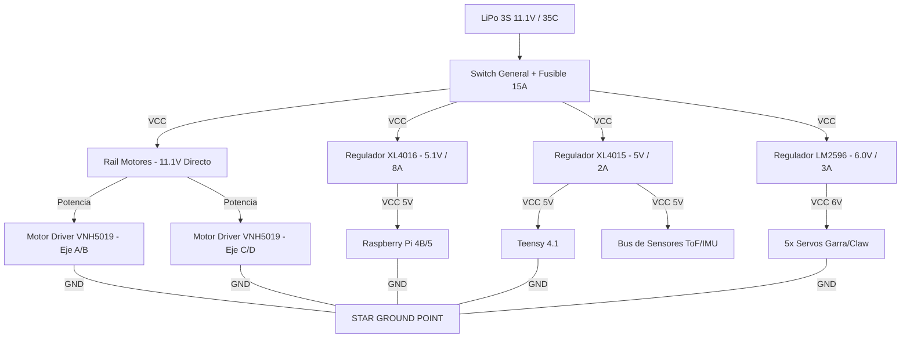

# Power Tree: Arquitectura de Distribución de Potencia RCJ 2026

> **Diseño por:** Ai Gemini - **A pedido de:** Gustavo Viollaz
> **Estado:** Draft de Ingeniería (v1.0)
> **Prioridad:** P0 (Evitar caídas de tensión por ruido de motores)

## 1. Visión General del Sistema (Star Ground)

El principal fallo en robots con Raspberry Pi + Motores de 12V es el **Ruido Electromagnético (EMI)** y el **Ground Bounce**. Para mitigar esto, este diseño utiliza un punto de tierra único (GND) y una separación física de rieles de potencia (Power Rails).

### Diagrama de Flujo (Lógica y Potencia)

---

## 2. Especificación Técnica de Componentes (BOM de Potencia)

| Componente | Rol | Rango Entrada | Salida | Corriente Max |
| :--- | :--- | :--- | :--- | :--- |
| **XL4016** | Alimentación RPi | 4V-40V | 1.25V-35V | 8A (Picos 12A) |
| **VNH5019** | Driver de Tracción | 5.5V-41V | Vin | 30A (Carga Real 12A) |
| **INA219** | Telemetría Bat | I2C | Datos Digitales | 0-26V / 3.2A |
| **XL4015** | Control Lógico | 8V-36V | 1.25V-32V | 5A |

---

## 3. Guía de Construcción y Montaje (Best Practices)

### A. El Punto de "Star Ground"
Para evitar que el retorno de corriente de los motores (que puede llegar a 10A en rampa) interfiera con la Raspberry Pi:
1.  Soldar todos los cables negativos (negros) a un solo bus de cobre o placa gruesa cerca de la batería.
2.  **No** encadenar tierras (daisy chain) de un regulador a otro.

### B. Filtrado de Motores (Ruido de Escobillas)
Añadir **capacitores cerámicos de 0.1uF** directamente en los terminales de cada motor (de polo a polo y de cada polo a la carcasa). Esto protege al sensor **BNO055** de interferencias magnéticas.

### C. Aislamiento de la Raspberry Pi
- El regulador **XL4016** debe estar ajustado a **5.1V** para compensar la caída de tensión en el cableado USB o en los pines GPIO.
- Usar cable de sección mínima **20 AWG** para alimentar la RPi. Cables más finos causarán el ícono de "rayo amarillo" (Under-voltage warning).

### D. Telemetría de Batería
Conectar el sensor **INA219** antes del Switch General o después del Fusible para medir el consumo total del sistema en tiempo real. La Teensy debe leer estos datos para advertir sobre voltaje bajo (<9.9V en una 3S).

---

## 4. Referencias Datasheets
- [Ficha Técnica XL4016 (Power Supply)](http://www.xlsemi.com/datasheet/XL4016%20datasheet.pdf)
- [Ficha Técnica VNH5019 (Motor Driver)](https://www.st.com/resource/en/datasheet/vnh5019a-e.pdf)
- [Ficha Técnica Teensy 4.1 (MCU Power)](https://www.pjrc.com/teensy/teensy41.html)
