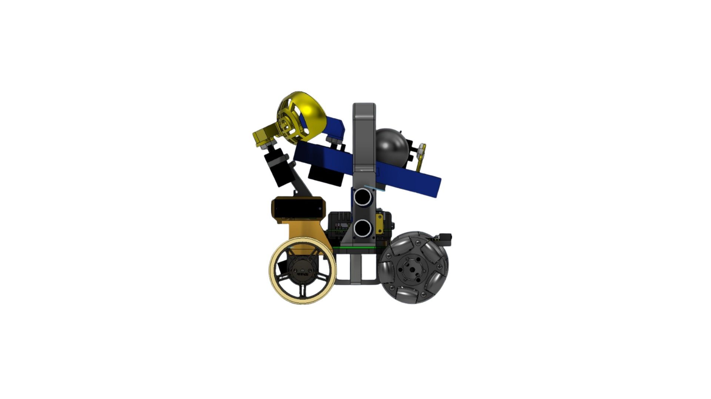
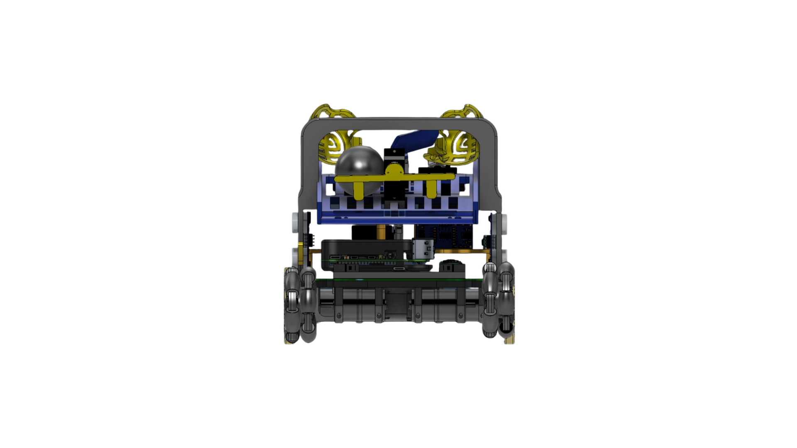
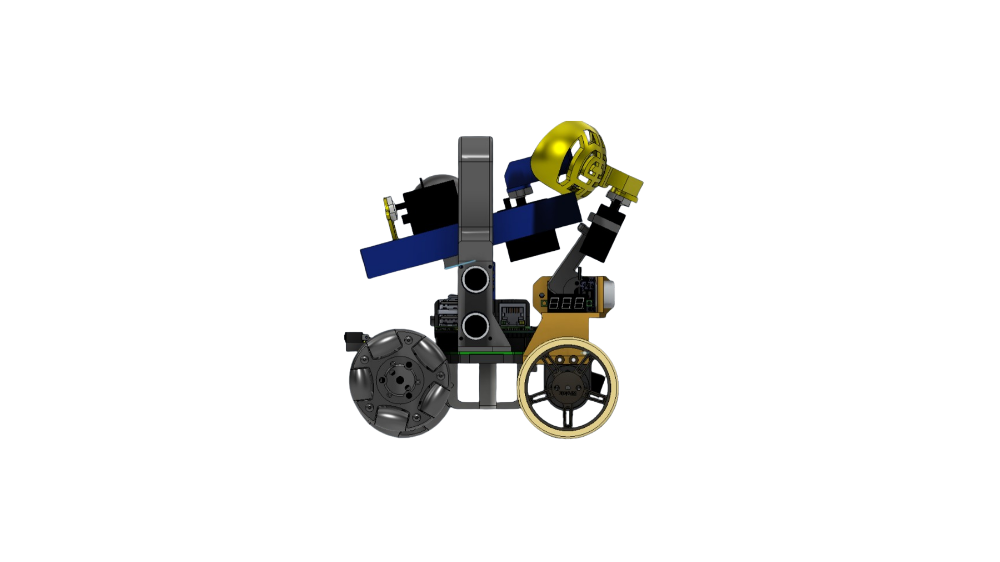
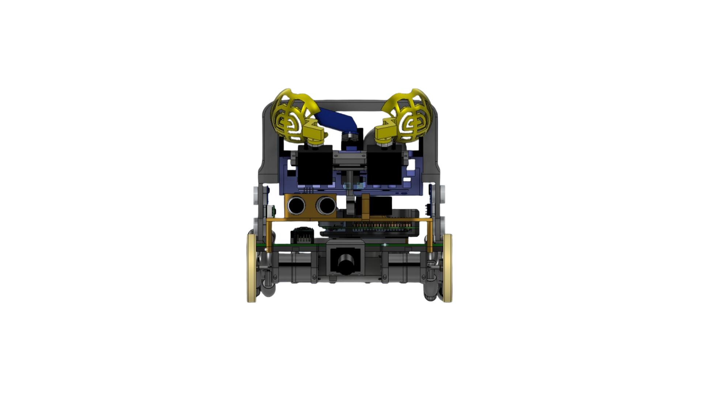
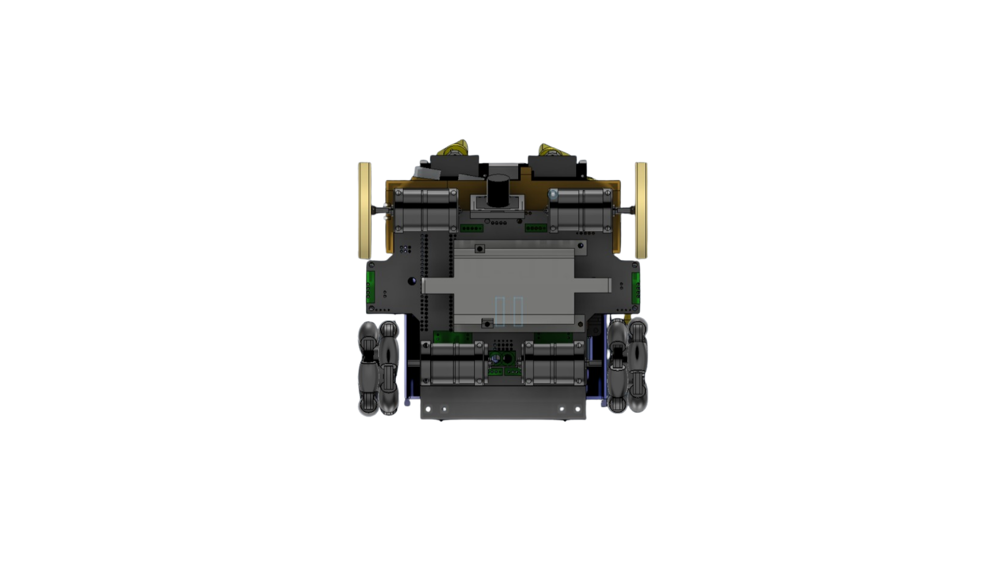
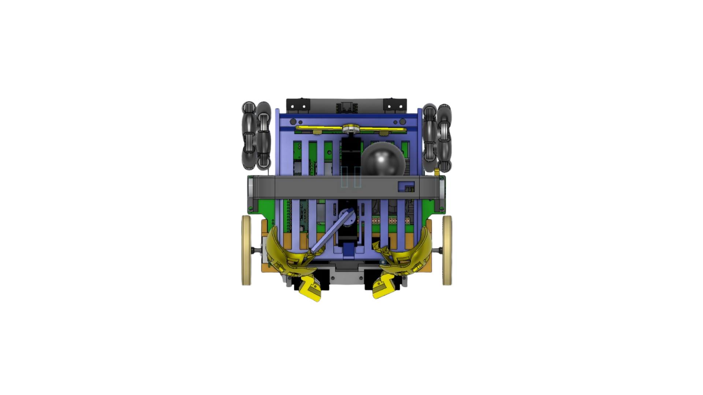

# Mechanical Design - Fusion 360

This folder contains the current mechanical model of the IITA Salta Rescue Line robot for RoboCup Junior 2026. The main file is the editable Fusion 360 assembly and is used as the reference for the chassis layout, claw mechanism, sensor mounts, electronics placement and mounting points.

## Main File

| File | Description |
|---|---|
| [Final_Robot.f3z](Final_Robot.f3z) | Complete robot file exported from Fusion 360. It includes the final assembly and its associated components. |

## Design Summary

The CAD model groups the main mechanical parts of the robot:

- Main chassis/base of the robot.
- Motor mounts and traction system.
- Front claw with servos for collecting and depositing victims.
- Mounts for distance sensors, camera and lower detection sensors.
- Mounting spaces for the Raspberry Pi, electronics, battery and internal wiring.
- Auxiliary parts for guiding balls/victims and keeping the mechanism compact.

The goal of the design is to keep the robot 3D-printable, easy to disassemble for maintenance and spacious enough for the planned hardware improvements: lower LED for the APDS9960, ESP32 Super Mini communication module, rear limit switches and flexible wiring for claw conductivity detection.

## Robot Views

Save the screenshots exported from Fusion 360 in the [`images/`](images/) folder using these names so GitHub displays them in an organized way.

| View | Suggested file | What it should show |
|---|---|---|
| Left side | `images/left.png` | Traction profile, claw and total height. |
| Back | `images/back.png` | Rear side, wiring space and possible limit switch placement. |
| Right side | `images/right.png` | Opposite profile and assembly symmetry. |
| Front | `images/front.png` | Claw, front sensors and overall width. |
| Bottom | `images/bottom.png` | Lower sensors, APDS9960/LED mount and floor clearance. |
| Top | `images/top.png` | Electronics, battery and chassis layout. |

## Gallery

## Existing Material

The [`_legacy/CAD/`](_legacy/CAD/) folder keeps the previous robot material:

- Previous screenshots of the model.
- Previous editable file (`Rescue3D.f3d`).
- Historical STLs for the base, mounts, claw, case, fins, camera, ultrasonic sensors and auxiliary parts.

That material remains as reference, but the recommended file for continuing the design is [`Final_Robot.f3z`](Final_Robot.f3z).
