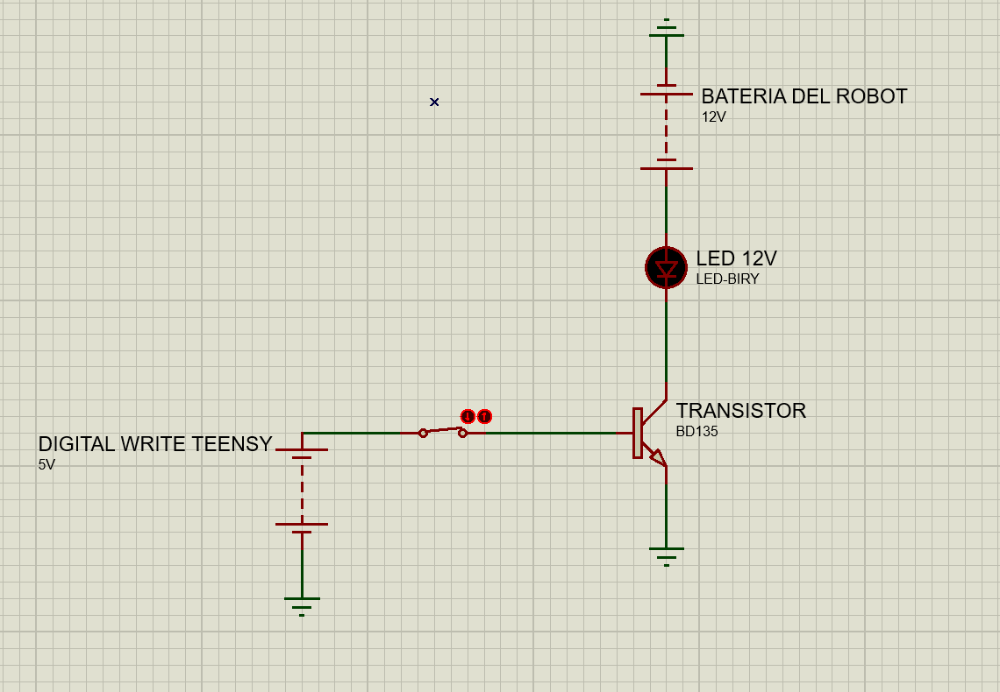

## OBJETIVO DEL CIRCUITO: CONTROLAR LEDS DE 12V MEDIANTE UN PIN DIGITAL DE LA TEENSY

---
### ESQUEMATICO

### Primero, ¿qué es un transistor?

Es un componente electrónico que puede funcionar como interruptor o amplificador, y nos permite controlar corrientes grandes usando señales pequeñas.  
Es como un **"interruptor" que se activa con una orden**.

Podemos ejemplificarlo con una llave de agua:

- El caño de nuestra casa (12V) está lleno de agua (corriente).
- La llave controla si esta agua pasa o no.
- Cuando la mano (Teensy) no toca la llave, esta queda cerrada y el agua (corriente) no pasa.
- Cuando la mano (Teensy) gira la llave (manda 5V a la base), se abre el paso y el agua puede fluir desde la cañería (12V) hacia el piso (GND).

Con muy poco esfuerzo desde la Teensy (una señal chiquita en la base), se puede controlar una corriente mucho más grande.  
**Por eso el transistor es un componente clave en electrónica.**

---

### Ahora sí, volviendo al circuito:

No podemos controlar 12V directamente con el Teensy, ya que se podría quemar por sobretensión o exceso de corriente.

Por eso usamos un transistor, que en este circuito se utiliza como **interruptor**.  
Para que funcione de esta manera, el transistor necesita que se le aplique un **voltaje en la base**, lo cual permite que fluya una **corriente mayor entre el colector y el emisor**.

Gracias a esto, podemos controlar cargas como **sensores, actuadores, LEDs, etc.**

---

### Comportamiento del circuito:

- Cuando el pin digital del Teensy está en 0V, el transistor está en **corte**, o sea, no conduce.
- El circuito está **“abierto”**, no hay conexión entre colector y emisor.
- Entonces el LED **no tiene un camino completo hacia GND**, el voltaje Vbe es menor a 0.7V y **el LED no se prende**.

Ahora, cuando el Teensy envía **5V por su pin digital (HIGH o 1)**, **el LED se enciende**.

El transistor actúa como un **interruptor cerrado** entre colector y emisor, y la corriente empieza a fluir así:
12V → LED → colector → emisor → GND
Así, **nuestro circuito se enciende**.

---

### Entonces, ¿por qué no se quema la Teensy?

Porque la corriente que pasa por el pin digital es **muy pequeña (uA, microamperios)**,  
y la **corriente grande** que alimenta al LED **pasa solamente por el colector y el emisor del transistor**, no por la Teensy.

### A FUTURO
- **Consideraciones de seguridad**: Aunque este circuito es relativamente simple, es importante verificar que los componentes estén correctamente **conectados** para evitar riesgos de daño a los componentes o la Teensy.
- **Elección del transistor BD135**:
  
  Elegí el **BD135** en lugar de otros transistores de baja potencia por varias razones:
  
  - **Rango de voltaje y corriente**: El BD135 es un transistor NPN de **potencia media**, con una **corriente máxima de colector de 1.5A**, lo cual es suficiente para manejar LEDs de 12V en este circuito sin preocuparse por una posible sobrecarga. Transistores de baja potencia podrían no ser capaces de manejar cargas más grandes de forma segura.
  
  - **Costo**: El **BD135** es fácil de conseguir y muy económico.
  
  - **Robustez**: Este transistor tiene una buena **resistencia a la sobrecarga térmica** y **disipación de calor** para proyectos sencillos que no exigen un manejo intensivo de potencia.
  
  - **Facilidad de manejo**: A pesar de ser un transistor de **potencia media**, el BD135 ofrece **facilidad de uso** en aplicaciones de baja y media corriente, lo que lo hace perfecto para este tipo de circuitos donde controlamos cargas moderadas como LEDs de 12V.

### Cálculos:

- **Cálculo de la corriente de base (Ib):**

Para activar el transistor, necesitamos calcular la corriente de base (Ib) que debe ser suficiente para permitir el flujo de corriente entre el colector y el emisor (Ic). Para esto, usaremos la **relación de ganancia de corriente (hFE)** del transistor, que nos dice cuántas veces la corriente de base es amplificada en la corriente de colector.

### Justificativo de los Cálculos

Sabemos que la relación es la siguiente:

    Ic = hFE * Ib

**Datos del fabricante:**
- **Ic (corriente de colector)** = 20 mA (corriente que pasa por el LED de 12V).
- **hFE (ganancia de corriente)** ≈ 100 (valor típico para el transistor BD135).
- **Vbe (tensión base-emisor)** ≈ 0.7V (valor estándar cuando el transistor se activa).

Para calcular la corriente de base (Ib), necesitamos despejarla de la fórmula anterior:

    Ib = Ic / hFE

Sustituyendo los valores:

    Ib = 20 mA / 100 = 0.2 mA

Por lo tanto, la corriente de base necesaria para que el transistor active correctamente el LED es **0.2 mA**.

#### Cálculo de la Resistencia de Base (Rb):

Ahora que sabemos la corriente de base necesaria, necesitamos determinar el valor de la resistencia de base (Rb) que se conectará entre el pin digital del Teensy y la base del transistor. Para esto, utilizamos la ley de Ohm.

Sabemos que la Teensy envía aproximadamente **5V** por su pin digital. La corriente de base es de **0.2 mA**, y la tensión entre la base y el emisor del transistor (Vbe) es de aproximadamente **0.7V**.

La diferencia de voltaje entre el pin digital de la Teensy y la base del transistor es:

    V_in - Vbe = 5V - 0.7V = 4.3V

Ahora, usando la ley de Ohm para calcular la resistencia de base:

    Rb = V / I = 4.3V / 0.2mA = 4.3V / 0.0002A = 21,500 Ω

Por lo tanto, la resistencia de base debe ser **aproximadamente 22kΩ** para que la corriente de base sea de **0.2 mA**.

#### Cálculo de la Potencia Disipada en el Transistor:

Finalmente, para asegurarnos de que el transistor no se dañe por el calor generado, calculamos la potencia disipada en el transistor. Sabemos que la corriente de colector (Ic) es de **20 mA** y que la caída de voltaje colector-emisor (Vce) es aproximadamente **1V** cuando el transistor está en funcionamiento.

La potencia disipada en el transistor se calcula con la siguiente fórmula:

    P = Vce * Ic

Sustituyendo los valores:

    P = 1V * 20mA = 0.02W = 20mW

Esto indica que el transistor disipa **20 mW** de potencia, lo cual es una cantidad bastante baja, por lo que no será necesario un disipador de calor para este caso y no equipara mucho espacio en nuestro robot.